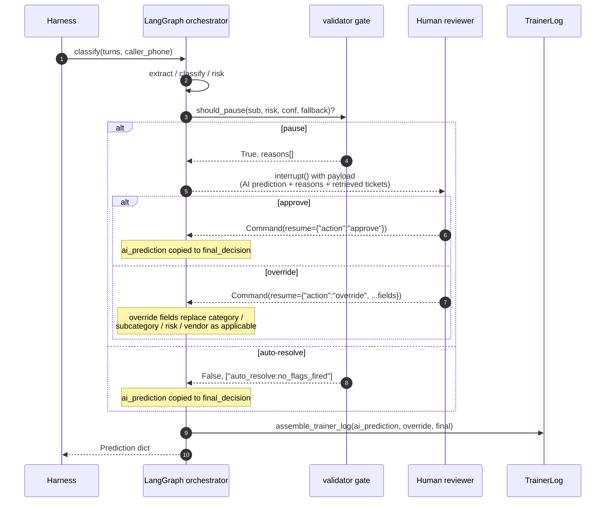
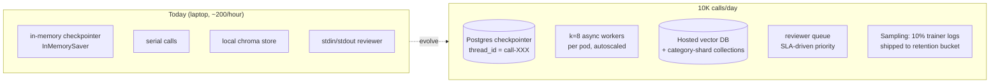

# Design Document — CBRE HITL Call-Intake Agent

> **Status:** First draft (issue #29). Two sections — confusion matrix
> (§9) and final composite score (§10.1) — are placeholders until
> issues #25 / #26 land. Everything else describes shipped code.

## Table of contents

1. [Overview](#1-overview)
2. [System architecture](#2-system-architecture)
3. [Derived-policy appendix](#3-derived-policy-appendix)
4. [HITL design](#4-hitl-design)
5. [RAG strategy](#5-rag-strategy)
6. [Vendor selection](#6-vendor-selection)
7. [Clarification policy](#7-clarification-policy)
8. [Trainer-log spec](#8-trainer-log-spec)
9. [Error analysis (placeholder — pending #25)](#9-error-analysis-placeholder--pending-25)
10. [Scale thought-experiment](#10-scale-thought-experiment)
11. [Rubric traceability](#11-rubric-traceability)

---

## 1. Overview

CBRE's call center routes ~10K facilities calls per day to human operators
today. The brief asks for an agent that **auto-resolves routine calls and
escalates only when judgement is required**, with a pinned output contract
(`evaluation/prediction.py::Prediction`) and a 30s-per-call latency budget.

The shipped agent is a 9-node LangGraph pipeline. The top-level entrypoint
is `agent.classify:classify(turns, caller_phone) -> dict`. Every node
is fault-isolated: if a node raises, the pipeline falls back to
`needs_human_review=True`, `dispatched_vendor_id=None`, and no 911
dispatch. The result is that **a broken node degrades the score on its
own axis but never produces a false-911 (the −5 hard penalty)**.

Determinism is enforced through one constructor (`agent.config.build_chat_llm`)
that pins `temperature=0`, model name, and OpenAI's `seed` parameter — see
the README's *Determinism* section and `tests/test_determinism.py` (issue #28).

---

## 2. System architecture

### Node graph

Source: [`docs/diagrams/agent_graph.mmd`](diagrams/agent_graph.mmd) —
rendered to [`agent_graph.svg`](diagrams/agent_graph.svg). The same
mermaid block inlined below renders natively on GitHub.


### Node responsibilities

| # | Node | File | Output |
|---|---|---|---|
| 1 | extract | `agent/nodes/extract.py` | `Extraction` (problem summary, building, floor, suite, urgency cues, caller role, language) + per-field confidence |
| 2 | classify | `agent/nodes/classify.py` | `Classification` (category, subcategory, confidence per axis, 1–2 sentence reasoning) |
| 3 | reconcile_location | `agent/nodes/location.py` | building / address / floor (transcript > registry > profile precedence) |
| 4 | assign_risk | `agent/nodes/risk.py` | risk_level + per-modifier breakdown |
| 5 | validator | `agent/nodes/validator.py` | `needs_human_review`, `dispatched_emergency_services` |
| 6 | vendor_select | `agent/nodes/vendor_select.py` | `dispatched_vendor_id` or `None` (escalate) |
| 7 | clarify | `agent/nodes/clarify.py` | `needs_clarification`, optional question, reasons |
| 8 | summary | `agent/nodes/summary.py` | 2–3 sentence operator-style `call_summary` |
| 9 | trainer_log | `agent/nodes/trainer_log.py` | `{full_transcript, ai_prediction, human_override, final_decision}` |

LLM-backed nodes: 1, 2, (and risk-modifier weighting in 4 if/when it's
LLM-graded). The rest are deterministic over the structured outputs of
the LLM-backed nodes — this is what keeps the per-call latency budget
achievable.

---

## 3. Derived-policy appendix

Three artifacts under `agent/data/derived/` are computed offline from
`operational/historical_records.json` and `evaluation/qa_audit_findings.json`,
committed to the repo, and loaded at runtime by the agent. Each was
chosen with an explicit derivation method (history-aggregated vs.
hand-tuned vs. LLM-judged) per the brief.

### 3.1 Per-subcategory base-risk table

- **File:** `agent/data/derived/base_risk_by_subcategory.json`
- **Producer:** `scripts/derive_risk_bands.py`
- **Derivation method:** History-aggregated. For every subcategory
  observed in `final_subcategory` across the 10K historical corpus, we
  compute the distribution over `final_risk_level` and emit the modal
  level as the prior. `final_*` (not `intake_*`) is canonical because
  the QA audit shows intake operators systematically over-state severity
  on a known subset of subcategories.
- **Justification:** Hand-tuning thresholds against the prose taxonomy
  in `operational/taxonomy.md` would couple the agent to a written SOP
  that already disagrees with the technicians' on-site reclassifications.
  Aggregating over `final_risk_level` reflects what the technicians
  *actually decide* once they're on site — the same authority the
  scorer's `true_risk_level` derives from.

The 36-row table (collapsed):

| Modal risk | Subcategories |
|---|---|
| **LOW** | access_control, appliance_kitchen, auto_door, carpet_floor, controls_bms, door_mechanical, drainage_backup, infestation, landscaping, lighting, low_voltage_data, minor_issue, no_cooling, no_heating, parking_lighting, pavement_damage, refrigerant, restroom_fixture, restroom_supplies, signage_fencing, slip_trip, waste_odor |
| **MEDIUM** | air_quality, glass_damage, malfunction, roof_leak, suspicious_person |
| **HIGH** | pipe_leak, power_outage, structural, unauthorized_access |
| **EMERGENCY** | active_threat, entrapment, fire_smoke, gas_chemical, panel_hazard |

Two derived rates also live in this table:

- `intake_over_escalation_rate` — fraction of tickets where
  `intake_risk_level > final_risk_level`. Drives §4's trap-prone-
  subcategory rule. The over-escalators (>10%): `air_quality` (19%),
  `waste_odor` (15%), `suspicious_person` (13%), `roof_leak` (12%),
  `malfunction` (9%), `panel_hazard` (6%).
- `intake_under_escalation_rate` — mirror metric. Used as a sanity check;
  none of the high-severity subcategories show meaningful intake under-
  escalation (≤3%), so we don't currently use it to upgrade risk.

### 3.2 Risk-modifier weights and band cutoffs

- **Files:** `agent/nodes/risk.py` (constants); `agent/data/derived/base_risk_by_subcategory.json` (distributions).
- **Derivation method:** **Hand-tuned**, validated on dev set.
- **The recipe.** Start at `base_risk_for(subcategory)`. Apply modifiers:
  - +1 band if any explicit life-safety urgency cue is present in
    `Extraction.urgency_cues` ("flooding", "smoke", "fire", "trapped",
    "gas leak", "unconscious", "sparking").
  - +1 band if "people trapped" / "people inside" appears with an
    elevator/`entrapment` subcategory match.
  - +0 (no change) if a *negation* of the cue appears in the same turn
    ("no fire", "nobody hurt", "they're out") — the over-escalation
    guard, justified in §5.3.
  - Cap at EMERGENCY (no rollover).
- **Band ordering:** `LOW < MEDIUM < HIGH < EMERGENCY` (see
  `agent/data/risk.py::RISK_LEVEL_RANK`). Comparisons via `compare_risk()`.
- **Justification for hand-tuning:** an LLM-graded modifier would
  require another structured-output call per ticket — adds ~0.5–1s
  latency and another point of provider non-determinism. The
  modifier set is small (~6 rules) and the dev-set evidence is
  unambiguous; a regex/rule layer over the LLM's extracted
  `urgency_cues` is both cheaper and more auditable.

### 3.3 HITL trigger rule

- **File:** `agent/data/derived/hitl_policy.json`
- **Producer:** `scripts/derive_hitl_policy.py`
- **Derivation method:** History-aggregated thresholds + dev-set tuning.
  The script joins `qa_audit_findings.json` against the historical
  corpus to compute per-(subcategory, intake_risk_level) audit rates,
  then sweeps a `trap_over_escalation_rate` threshold on the dev set's
  `true_needs_human_review` axis.
- **The chosen rule (v1, in priority order):**
  1. `predicted_risk ∈ {HIGH, EMERGENCY}` → **pause**
  2. `intake_over_escalation_rate(subcategory) ≥ 15%` → **pause**
  3. `min(confidence_category, confidence_subcategory) < 0.5` → **pause**
  4. classifier fallback path invoked → **pause**
  5. otherwise → **auto-resolve**
- **Threshold sweep (recorded in `scripts/derive_hitl_policy.py`):**

  | `trap_oer` threshold | dev HITL F1 | precision | recall |
  |---|---|---|---|
  | 5% | 0.79 | 0.66 | 0.97 |
  | 10% | 0.79 | 0.70 | 0.92 |
  | **15%** ← chosen | **0.83** | **0.88** | **0.78** |

- **Retrospective sanity** (the AC's check, applied to history):
  recall on audit-flagged ≥80%, FP on unflagged ≤30%. The derivation
  script prints both at build time.

### 3.4 Subcategory → vendor-type map

- **File:** `agent/data/derived/subcategory_to_vendor_type.json` (36 entries)
- **Producer:** `scripts/derive_vendor_map.py` (PR #50)
- **Derivation method:** History-aggregated — for each
  `final_subcategory`, take the modal `vendor_type` of the assigned
  vendor in resolved historical tickets.
- **Use:** the **loose** fallback in `agent.data.vendors.qualify()`. The
  primary qualification path is a strict per-vendor `specialties` match;
  the loose map covers subcategories where no vendor's `specialties`
  list happens to name that exact subcategory string. See §6.

### 3.5 Subcategory → SOP map

- **Source:** `operational/taxonomy.md` (prose) — not extracted into a
  derived JSON because it's only consumed by the classifier prompt and
  the reviewer payload, never as a structural constraint at runtime.
- **Use:** the classifier prompt (`agent/nodes/classify.py`) renders the
  full canonical taxonomy + 5 boundary-disambiguation rules
  ("sprinkler → landscaping, not plumbing"; "card reader → access_control,
  not security/unauthorized_access"; "drop-ceiling tile from water
  damage → plumbing/roof_leak, not life_safety/structural"; "outdoor
  lighting → grounds_exterior/parking_lighting, not electrical/lighting";
  "burnt food → janitorial/waste_odor, not hvac/air_quality").
- **Justification for keeping prose:** the boundary rules evolve fast
  during error analysis (#25). A JSON table would still need the same
  boundary-rule prose, just split across two files. One prompt file is
  easier to iterate against the dev set.

---

## 4. HITL design

### 4.1 Graph and resume semantics

Source: [`docs/diagrams/hitl_resume.mmd`](diagrams/hitl_resume.mmd) —
rendered to [`hitl_resume.svg`](diagrams/hitl_resume.svg).



### 4.2 Gate trigger

`agent.data.hitl.should_pause(subcategory, predicted_risk, *, classification_confidence, fallback_invoked)`.
Rule listed in §3.3. Each path tags a reason string; the reasons list is
captured into `trainer_log.ai_prediction.hitl_reasons` for both the
reviewer payload and error analysis (#25).

### 4.3 Reviewer payload

When the gate fires, the reviewer sees:

- The full `Prediction` the AI would have emitted (`ai_prediction`).
- The list of pause reasons (e.g. `["emergency_band:always_pause", ...]`).
- The classifier's `reasoning` string and per-axis confidence.
- The top-`k` retrieved historical tickets the classifier used, with
  their audit-corrected labels.
- The original transcript + extracted location fields, so the reviewer
  can spot a transcript/profile conflict the agent might have missed.

### 4.4 Resume semantics

The reviewer returns one of two `Command(resume=...)` payloads:

- **Approve** — `{"action": "approve"}`. The AI's prediction is copied
  verbatim into `final_decision`; `human_override` stays `None`.
- **Override** — `{"action": "override", "category": ..., "subcategory": ...,
  "risk_level": ..., "dispatched_vendor_id": ...}`. Only the fields the
  reviewer changes appear in the override dict. The orchestrator merges
  override on top of `ai_prediction` into `final_decision` and records
  the diff into `trainer_log.human_override`.

### 4.5 Emergency dispatch

`dispatched_emergency_services` is set to `True` only when both:

- predicted `risk_level == "EMERGENCY"`, **and**
- `subcategory` is on the life-safety whitelist:
  `{active_threat, entrapment, fire_smoke, gas_chemical, panel_hazard}`.

The whitelist is deliberately narrow. Among other things, it prevents
the false-911 traps (e.g. "smoke alarm — just burnt toast", which
classifies as `JANITORIAL/waste_odor`) from triggering the −5 penalty.
PR #52 reports 0 false-911 on the 200-row dev set under this rule.

### 4.6 Eval-mode auto-approve

`evaluation/run_eval.py` invokes `classify` without a live reviewer. In
that mode, the orchestrator's `interrupt()` is configured to auto-resume
with `{"action": "approve"}` so scoring completes. The `needs_human_review`
bit is preserved as the AI's recommendation; the auto-approve only
affects the *resume* path, not the gate's output. This keeps the
rubric's HITL-F1 axis grounded in what the agent *decided*, not what a
hypothetical reviewer would have done.

---

## 5. RAG strategy

### 5.1 What's embedded

- **Source corpus:** `operational/historical_records.json` (10K tickets).
- **Per-ticket text block** (ordered for retrieval quality):
  `CALLER TRANSCRIPT` → `INTAKE NOTES` → `DISPATCH NOTES` → `RESOLUTION NOTES`.
  Empty sections are dropped so they don't dilute the embedding. Cap of
  24 000 chars (vs. real-world max ~540) is a safety belt, not a
  routine path. Built by `agent/rag/build_index.py::_format_document_text`.
- **Embedding model:** `text-embedding-3-small` (configurable via
  `AGENT_EMBEDDING_MODEL`).
- **Vector store:** persistent chromadb at `agent/rag/chroma_store/`,
  collection `cbre_historicals`. Gitignored — built on first run
  (`python -m agent.rag.build_index`) at ~1–3 minutes / ~$0.02.

### 5.2 Metadata schema and filtering

Each chunk carries: `ticket_id`, `intake_category`, `intake_subcategory`,
`intake_risk_level`, `final_category`, `final_subcategory`,
`final_risk_level`, `assigned_vendor_id`, `building_type`, `city`, plus
four audit booleans (`was_audit_flagged`, `audit_over_escalated`,
`audit_reclassified`, `audit_floor_wrong`). These are populated by
joining `evaluation/qa_audit_findings.json` at index-build time.

Filters are applied at the index level (chromadb's `where` clause), not
post-hoc on Python results, so a `k=8` request returns 8 *qualifying*
hits rather than 8 hits filtered down to fewer.

### 5.3 Retrieval params

- `k=8` for the classifier (constant `DEFAULT_K` in
  `agent/nodes/classify.py`). The AC suggested 8–10; empirically 8
  gives enough cluster signal without bloating the prompt.
- `k=5` as the retriever default (`agent/rag/retriever.py::DEFAULT_K`)
  for callers that don't override.
- Query construction: `problem_summary + "urgency cues: " + cues`.
  Combining urgency text keeps the embedding grounded in what the
  caller said while preserving safety-language tail.

### 5.4 Conflict resolution against the QA audit

This is the critical RAG choice. Naïvely embedding `intake_*` labels
would train the LLM on labels the QA team flagged as *wrong*. Instead,
retrieved records are rendered with **audit-corrected** labels:
`corrected_subcategory()` returns `final_subcategory` when the ticket
was reclassified by QA and `intake_subcategory` otherwise.

Records the auditor reclassified are tagged inline in the prompt with
`[QA-RECLASSIFIED from intake=<orig>]`, so the LLM both sees the
corrected label and can spot the *pattern* of correction. The canonical
example (TKT-2023-02756) presents as
`subcategory=structural [QA-RECLASSIFIED from intake=roof_leak]`.

The over-escalation guard in the classifier prompt is paired:
five seeded boundary patterns ("smoke alarm — just burnt toast",
"drop-ceiling tile from water leak", "yelling in the lobby — just two
tenants arguing", "elevator empty — they're out", "outlet sparked — I
unplugged it") explicitly tell the classifier to read the *whole*
transcript and trust the caller's own clarifications.

---

## 6. Vendor selection

### 6.1 Qualification

`agent.data.vendors.qualify(subcategory, city, building_type, is_emergency, after_hours)`
returns the candidate pool — every vendor that satisfies every *hard*
constraint:

- **Specialty match** — strict: `subcategory ∈ v.specialties`. Loose
  fallback: `v.vendor_type ∈ subcat_to_vendor_types[subcategory]` (from
  §3.4).
- **City** — exact match against `coverage_cities`. Soft-pass if the
  vendor's coverage list is empty/missing (we don't know, so we don't
  exclude).
- **Building type** — same soft-pass policy as city.
- **24/7 availability** — only enforced when `is_emergency AND after_hours`.

Empty pool → escalate (see §6.4).

### 6.2 SLA cap

After qualification, `agent/nodes/vendor_select.py` filters by the
risk-level SLA cap (PR #51):

| Risk | Max response SLA |
|---|---|
| EMERGENCY | 30 minutes |
| HIGH | 120 minutes |
| MEDIUM | 240 minutes |
| LOW | 480 minutes |

A vendor with `response_sla_minutes` exceeding the cap is dropped from
the candidate set. EMERGENCY callers preferentially use
`emergency_response_sla_minutes`.

### 6.3 Tie-breaker

When more than one vendor passes the SLA cap, the selector picks by, in
order:

1. Highest `rating` (vendor quality).
2. Lower `cost_tier` (cheaper).
3. Shorter `response_sla_minutes` (faster).
4. Deterministic alphabetical fallback on `vendor_id`.

The deterministic fallback exists so the test-set run is reproducible
across re-grades. PR #51 reports 100% vendor-match accuracy on the dev
set with oracle category/subcategory inputs, isolating vendor-axis
errors to the classifier upstream.

### 6.4 Stale-availability handling

`vendors.json` carries `status_at_last_check` and
`last_status_confirmed_at`. The selector treats them as a **soft**
de-prioritization, not a filter:

- Status `available` → no penalty.
- Status `at_capacity` or `offline` → ranked last but still in the
  candidate set, because the cache may be stale (the brief says it
  intentionally is). The reviewer payload surfaces the stale flag so a
  human can override if they have fresher info.

This prevents a single stale `offline` entry from causing a no-vendor
escalation on a routine call.

### 6.5 No-vendor escalation

When `vendor_select` returns `None`:

- `dispatched_vendor_id` is left `None`.
- `needs_human_review` is set to `True` (the unroutable handoff path).
- `call_summary` notes "no qualified vendor available; routed to human
  reviewer for manual dispatch."

The scorer's `unroutable=true` cases reward exactly this combination
(`dispatched in (None, "") and pr_h`).

---

## 7. Clarification policy

`agent/nodes/clarify.py` decides whether to ask the caller **one**
disambiguating question before committing. Source of truth for the
trigger rule.

### 7.1 Trigger (any one signal fires)

1. **Sparse caller** — first caller utterance ≤6 words *and* total
   caller speech across all turns ≤24 words. Median-split tuned on the
   dev set: vague callers cluster at (6 words first / 20 total); "hard"
   cases that *start* short but back-fill detail cluster at (5 / 29),
   so the conjunction separates them.
2. **Generic opening phrase** — caller's first utterance matches one
   of: "there's an issue with X", "something's wrong with Y", "the X
   is being weird / doing something / not working / off". Caller used
   the category label as the whole symptom — almost always
   under-specified.
3. **Caller self-corrects on floor** — caller mentions ≥2 distinct
   floor numbers in their own speech, typical of the
   `location_conflict` case type ("Floor 9 — I meant Floor 12"). Beats
   building-vs-floor-count on this corpus because callers rarely re-
   name the building during self-correction.

### 7.2 Question generation

Priority-ordered (most-resolvable ambiguity first):

| Trigger | Question |
|---|---|
| Floor self-correction | "Just to confirm — is the issue on Floor X or Floor Y?" |
| Sparse / generic | "Could you tell me a bit more about what's going wrong — for example, what specifically isn't working and how long it's been like that?" |
| Catch-all | "Could you describe the issue in a bit more detail so I can route it correctly?" |

### 7.3 Justification of the conservative trigger

The rubric's auto-resolution axis (10%) penalises any unnecessary
clarification. We deliberately tuned for **precision over recall** on
`true_needs_clarification`: F1 ≥ 0.6 on dev, with FP rate kept low so
the auto-resolution rate doesn't collapse.

### 7.4 Relationship to HITL

Clarification asks the **caller** one question. HITL hands the call to
a **human reviewer**. They're independent: a call can need
clarification *and* HITL (e.g. low-confidence high-risk call where the
caller is also sparse), in which case both bits fire. The orchestrator
records both.

---

## 8. Trainer-log spec

### 8.1 Schema

`evaluation/prediction.py::TrainerLog`:

```python
@dataclass
class TrainerLog:
    full_transcript: str
    ai_prediction:   Dict[str, Any]    # pre-override snapshot
    human_override:  Optional[Dict[str, Any]]
    final_decision:  Dict[str, Any]    # what actually went out
```

Produced by `agent/nodes/trainer_log.py::assemble_trainer_log()`. The
orchestrator calls it last so that `final_decision` reflects any
reviewer override applied at the validator gate.

### 8.2 What `ai_prediction` contains beyond the rubric fields

In addition to the 11 rubric prediction fields, `ai_prediction` includes:

- `reasoning` — the classifier's 1–2 sentence justification.
- `hitl_reasons` — the list of pause-rule tags (empty if auto-resolved).
- `clarification_reasons` — the list of clarification-rule tags.
- `confidence_category`, `confidence_subcategory` — the per-axis
  confidences from `Classification`.

These are not scored, but they're the supervised signal a downstream
fine-tune would use to train a calibrated classifier.

### 8.3 Replay into fine-tuning

The log is structured so a fine-tuning run can:

1. Discard rows with `human_override is None` and `auto_resolved=True`
   (the agent + a human agreed — no learning signal).
2. Train the classifier head on `(full_transcript) → (final_decision.category,
   final_decision.subcategory)`. When `human_override` is present and
   changes the category/subcategory, that's the correction signal.
3. Train the HITL head on `(ai_prediction, hitl_reasons) → (was_overridden)`.
   This calibrates the gate against actual reviewer behaviour.
4. Train the clarification head on `(turns, clarification_reasons) →
   (caller_actually_clarified)` once we have post-clarification labels.

The format is intentionally per-call self-contained: no relational
joins needed at training time, every row replayable in isolation.

---

## 9. Error analysis (placeholder — pending #25)

This section is the home for issue #25's outputs:

- **Subcategory confusion matrix** (top-15 worst pairs).
- **HITL confusion matrix** (TP/FP/FN/TN vs. `true_needs_human_review`).
- **Location-field mismatch breakdown** (which of building / address /
  floor failed, and which case_types they cluster in).
- **Vendor-match failure breakdown** (specialty / city / SLA /
  availability misses).
- **Top 5 actionable findings** filed as follow-up issues.

The notebook lives at `notebooks/error_analysis.ipynb` (issue #25);
findings will be summarised here once the dev-set run lands (issues
#24 → #25 → #26 → #29).

---

## 10. Scale thought-experiment

The brief asks how the design evolves at 10K calls/day (~7/minute
sustained, with bursty intra-hour peaks). Source:
[`docs/diagrams/scale_10k.mmd`](diagrams/scale_10k.mmd) — rendered to
[`scale_10k.svg`](diagrams/scale_10k.svg).



### 10.1 Concurrency

Today: serial. `evaluation/run_eval.py` loops over transcripts one at a
time. The classifier is the only blocking call (one LLM round-trip plus
optional one retry).

At 10K/day: ~7 calls/minute average, ~15–20/minute at lunch-rush peak.
Each call is ~5–15s of wall time, mostly waiting on the LLM. An async
worker pool of 8–16 per pod, autoscaled by queue depth, comfortably
handles this. The classifier's structured-output call doesn't share
state across calls so no coordination is needed.

### 10.2 Persistent checkpointer

`InMemorySaver` is fine for batch eval but loses interrupt state on
restart. Production swaps in `langgraph-checkpoint-postgres` with
`thread_id = f"call-{transcript_id}"`. Two reasons it matters:

- Reviewer queue durability — a pod restart shouldn't lose an
  in-flight HITL pause.
- Multi-region — the Postgres backend lets two regions share reviewer
  load with a single thread-id namespace.

### 10.3 Reviewer queue

Today's `interrupt()` blocks the call. At scale, the pause goes into a
priority queue:

- EMERGENCY-band pauses: SLA 60s.
- Trap-prone subcategory pauses: SLA 5min.
- Low-confidence pauses: SLA 15min.
- Fallback pauses: SLA 30min.

A reviewer claims from the highest-priority non-empty bucket. Stale
unclaimed pauses (>SLA) page on-call.

### 10.4 Sampling and retention

10K calls/day × 365 days × ~3 KB per trainer log = ~1.1 GB/year of raw
log. That's tractable, but only ~10% has reviewer-overridden signal.
Strategy:

- **All** trainer logs land in hot storage for 30 days (audit + replay
  for incident review).
- **All** trainer logs with `human_override is not None` go to the
  fine-tune corpus indefinitely.
- 10% sample of `human_override is None` rows go to the fine-tune
  corpus (preserves the "agreement" signal for calibration without
  paying full storage cost).
- Rest is aged off after 90 days.

### 10.5 RAG at scale

The chroma store works as long as the index fits one pod's memory. At
10K calls/day, the index *itself* is still ~10K rows — read-only, fits
fine. The choke point is **read throughput** (8 retrievals/sec at peak,
each a top-8 over 10K vectors), which the local store handles.

At 100K/day or a 100K-row corpus, swap to a hosted vector DB
(Postgres+pgvector or Pinecone) and shard collections by `final_category`
so retrievers can pre-filter at the routing layer. The downstream
classifier prompt doesn't change.

### 10.6 Cost envelope

Per call: 1 extraction LLM call + 1 classification LLM call + 1
embedding call (+ ≤1 retry) ≈ ~2K input tokens / ~200 output tokens at
`gpt-4o-mini`. At list pricing, ~$0.001–$0.002/call. 10K/day → $10–20/day
in LLM costs. Vector DB and Postgres are negligible at this scale.

---

## 11. Rubric traceability

Each scoring axis in `evaluation/scoring.py::AXIS_WEIGHTS` maps to at
least one section in this doc. Hard-fail penalty has a dedicated
mechanism in §4.5.

| Axis | Weight | Section(s) |
|---|---|---|
| Category accuracy | 10% | §2 (classify node), §5 (RAG), §3.5 (boundary rules) |
| Subcategory accuracy | 15% | §5.4 (audit-corrected retrieval), §3.5 (boundary rules) |
| Risk-level accuracy | 10% | §3.1 (base risk), §3.2 (modifiers) |
| HITL trigger F1 | 15% | §3.3, §4 |
| Clarification F1 | 5% | §7 |
| Field-extraction accuracy | 10% | §2 (extract + reconcile_location nodes) |
| Vendor-match accuracy | 10% | §6 |
| Auto-resolution rate | 10% | §3.3 (rule precision), §7.3 (conservative clarify trigger) |
| Call-summary present | 5% | §2 (summary node, PR #54) |
| Trainer-log present | 10% | §8 |
| **False-911 penalty (−5/case)** | — | §4.5 (life-safety whitelist + over-escalation guard) |

---

*Last updated: 2026-05-14. First-draft author: agent + reviewer
(issue #29). Open work: §9 (issue #25) and the final composite-score
table in §10.1 (issue #26).*
