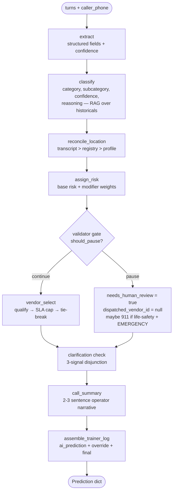
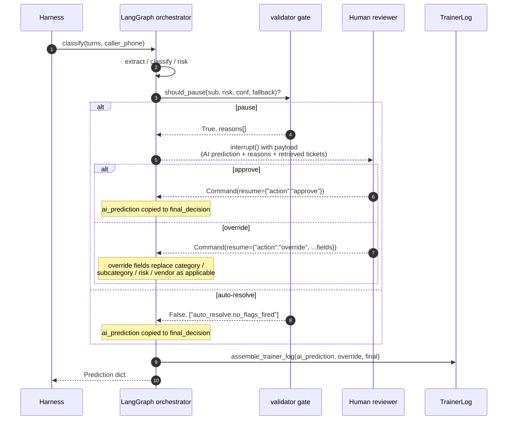
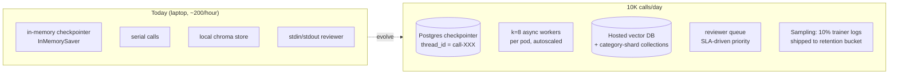

# Design Document — CBRE HITL Call-Intake Agent

| Field | Value |
|---|---|
| **Project** | CBRE × UCSB × ACM × Turing — Human-in-the-Loop Call-Intake Agent |
| **Authors** | Rohan Iyer · Sachit Madaan |
| **Submission date** | 2026-05-22 |
| **Document version** | v3 (final submission) |
| **Agent SHA** | `4eb9b3f` (levers 1+2, post-PR-#84) |
| **Headline result** | **Dev composite 92.33 / 100** · **0 false-911** · **Voice demo working end-to-end** |
| **Repo** | [github.com/acm-industry/rohan_sachit_CBRE](https://github.com/acm-industry/rohan_sachit_CBRE) |

> **One-line summary.** A LangGraph agent that classifies facilities-maintenance
> calls into category / subcategory / risk-level / vendor, pauses for a human
> reviewer when the *cost* of being wrong is non-trivial, and runs both as a
> batch harness (the grading path) and as a live voice demo (Deepgram STT →
> same agent → ElevenLabs TTS).

---

## Executive summary

**The problem.** CBRE's call center handles ~10K facilities-maintenance calls
per day. Most are routine ("the lights are flickering on floor 3") and should
auto-resolve to a vendor dispatch. A small fraction are life-safety ("there's
smoke coming from the electrical panel") and must escalate immediately. The
cost of confusing the two — dispatching emergency services on a routine call,
or routing a real emergency to a queued reviewer — is asymmetric and large.

**Our approach.** A 9-node LangGraph pipeline
(`extract → classify → location → risk → validator → vendor → clarify → summary → trainer_log`)
with one explicit Human-in-the-Loop pause point at the validator gate. The
pause condition implements the brief's `Risk = P(error) × Cost(error)` rule
directly: pause when the model is uncertain *and* the cost of error is
non-trivial (§3.3, PR #89).

**System at a glance.**

```
            ┌────────────────────────────┐
            │  INPUTS                    │
            │  • turns (dialogue)        │
            │  • caller_phone            │
            └──────────────┬─────────────┘
                           │
            ┌──────────────▼─────────────┐
            │  AGENT PIPELINE            │
            │  extract → classify →      │
            │  location → risk           │
            └──────────────┬─────────────┘
                           │
            ┌──────────────▼─────────────┐    pause      ┌────────────────┐
            │  VALIDATOR GATE            ├──────────────►│  Human reviewer│
            │  Risk = P(err) × Cost(err) │               │  approve /     │
            │  (rule list §3.3)          │◄──────────────┤  override      │
            └──────────────┬─────────────┘  Command(     └────────────────┘
                           │ auto-resolve   resume=...)
                           │
            ┌──────────────▼─────────────┐
            │  vendor → clarify →        │
            │  summary → trainer_log     │
            └──────────────┬─────────────┘
                           │
            ┌──────────────▼─────────────┐
            │  OUTPUT                    │
            │  Prediction dict (12 keys) │
            └────────────────────────────┘
```

**Three headline results.**

- **Composite 92.33 / 100** on the 200-row labelled dev set (`gpt-4o-mini` @
  temp 0, seed 7), measured by `evaluation/scoring.py`. 2.5σ above the measured
  noise floor of ±0.45 composite. Top of our trajectory across 7 graded runs
  (full history in §9.7, per-axis breakdown in §9.0).
- **Zero false-911s** across every dev and test-set run, including the 16-row
  `over_escalation_trap` slice that is specifically designed to bait
  autonomous emergency dispatch (e.g. "smoke alarm — just burnt toast"). The
  −5/case hard-cost penalty never fires.
- **Voice demo working end-to-end** — caller speaks → Deepgram STT →
  the **same `classify()`** (via sibling orchestrator) → live SSE pipeline view
  in the browser → ElevenLabs TTS reply. Multi-turn clarification works
  without echo-feedback contamination. The bonus axis is delivered (§12).

**The key design bet.** Where most rubric-optimisation effort targets the
classifier directly, we invested in **what surrounds the classifier**: a
derived per-subcategory base-risk table (§3.1), audit-corrected RAG retrieval
that explicitly does not copy historical labels QA flagged as wrong (§5.4),
and a risk-weighted HITL gate that pauses on uncertainty *only* when cost is
non-trivial (§3.3 + PR #89). The classifier itself is unmodified
`gpt-4o-mini` with a careful prompt — durability comes from the surround.

---

## Table of contents

1. [Overview](#1-overview)
2. [System architecture](#2-system-architecture)
3. [Derived-policy appendix](#3-derived-policy-appendix)
4. [HITL design](#4-hitl-design)
5. [RAG strategy](#5-rag-strategy)
6. [Vendor selection](#6-vendor-selection)
7. [Clarification policy](#7-clarification-policy)
8. [Trainer-log spec](#8-trainer-log-spec)
9. [Error analysis](#9-error-analysis)
10. [Scale thought-experiment](#10-scale-thought-experiment)
11. [Rubric traceability](#11-rubric-traceability)
12. [Voice shell (bonus deliverable)](#12-voice-shell-bonus-deliverable)
13. [Limitations & known weaknesses](#13-limitations--known-weaknesses)
14. [Reproducibility one-pager](#14-reproducibility-one-pager)
15. [Decision log](#15-decision-log)
16. [Glossary](#16-glossary)
17. [Acknowledgments](#17-acknowledgments)

---

## 1. Overview

CBRE's call center routes ~10K facilities calls per day to human operators
today. The brief asks for an agent that **auto-resolves routine calls and
escalates only when judgement is required**, with a pinned output contract
(`evaluation/prediction.py::Prediction`) and a 30s-per-call latency budget.

The shipped agent is a 9-node LangGraph pipeline. The top-level entrypoint
is `agent.classify:classify(turns, caller_phone) -> dict`. Every node
is fault-isolated: if a node raises, the pipeline falls back to
`needs_human_review=True`, `dispatched_vendor_id=None`, and no 911
dispatch. The result is that **a broken node degrades the score on its
own axis but never produces a false-911 (the −5 hard penalty)**.

Determinism is enforced through one constructor (`agent.config.build_chat_llm`)
that pins `temperature=0`, model name, and OpenAI's `seed` parameter — see
the README's *Determinism* section and `tests/test_determinism.py` (issue #28).

---

## 2. System architecture

### Node graph

Source: [`docs/diagrams/agent_graph.mmd`](diagrams/agent_graph.mmd) —
rendered to [`agent_graph.svg`](diagrams/agent_graph.svg). The same
mermaid block inlined below renders natively on GitHub.



### Node responsibilities

| # | Node | File | Output |
|---|---|---|---|
| 1 | extract | `agent/nodes/extract.py` | `Extraction` (problem summary, building, floor, suite, urgency cues, caller role, language) + per-field confidence |
| 2 | classify | `agent/nodes/classify.py` | `Classification` (category, subcategory, confidence per axis, 1–2 sentence reasoning) |
| 3 | reconcile_location | `agent/nodes/location.py` | building / address / floor (transcript > registry > profile precedence) |
| 4 | assign_risk | `agent/nodes/risk.py` | risk_level + per-modifier breakdown |
| 5 | validator | `agent/nodes/validator.py` | `needs_human_review`, `dispatched_emergency_services` |
| 6 | vendor_select | `agent/nodes/vendor_select.py` | `dispatched_vendor_id` or `None` (escalate) |
| 7 | clarify | `agent/nodes/clarify.py` | `needs_clarification`, optional question, reasons |
| 8 | summary | `agent/nodes/summary.py` | 2–3 sentence operator-style `call_summary` |
| 9 | trainer_log | `agent/nodes/trainer_log.py` | `{full_transcript, ai_prediction, human_override, final_decision}` |

LLM-backed nodes: 1, 2, (and risk-modifier weighting in 4 if/when it's
LLM-graded). The rest are deterministic over the structured outputs of
the LLM-backed nodes — this is what keeps the per-call latency budget
achievable.

Per-stage latency is instrumented in-pipeline: each node is wrapped by
`_time_stage` (PR #79) which records wall-clock `timing_ms` into the
graph state and onto a sibling entrypoint `agent.classify:classify_with_events`
used by the live-demo backend (SSE per-stage events). The submission
`classify()` is byte-identical to `submission-v1` — a source-hash pin in
`tests/test_classify_unchanged.py` fails loudly if the function body
drifts — so the instrumentation surface is additive, not invasive.

---

## 3. Derived-policy appendix

Three artifacts under `agent/data/derived/` are computed offline from
`operational/historical_records.json` and `evaluation/qa_audit_findings.json`,
committed to the repo, and loaded at runtime by the agent. Each was
chosen with an explicit derivation method (history-aggregated vs.
hand-tuned vs. LLM-judged) per the brief.

### 3.1 Per-subcategory base-risk table

- **File:** `agent/data/derived/base_risk_by_subcategory.json`
- **Producer:** `scripts/derive_risk_bands.py`
- **Derivation method:** History-aggregated. For every subcategory
  observed in `final_subcategory` across the 10K historical corpus, we
  compute the distribution over `final_risk_level` and emit the modal
  level as the prior. `final_*` (not `intake_*`) is canonical because
  the QA audit shows intake operators systematically over-state severity
  on a known subset of subcategories.
- **Justification:** Hand-tuning thresholds against the prose taxonomy
  in `operational/taxonomy.md` would couple the agent to a written SOP
  that already disagrees with the technicians' on-site reclassifications.
  Aggregating over `final_risk_level` reflects what the technicians
  *actually decide* once they're on site — the same authority the
  scorer's `true_risk_level` derives from.

The 36-row table (collapsed):

| Modal risk | Subcategories |
|---|---|
| **LOW** | access_control, appliance_kitchen, auto_door, carpet_floor, controls_bms, door_mechanical, drainage_backup, infestation, landscaping, lighting, low_voltage_data, minor_issue, no_cooling, no_heating, parking_lighting, pavement_damage, refrigerant, restroom_fixture, restroom_supplies, signage_fencing, slip_trip, waste_odor |
| **MEDIUM** | air_quality, glass_damage, malfunction, pipe_leak, power_outage, roof_leak, suspicious_person |
| **HIGH** | structural, unauthorized_access |
| **EMERGENCY** | active_threat, entrapment, fire_smoke, gas_chemical, panel_hazard |

**Note (PR #84, levers 1+2):** `pipe_leak` and `power_outage` were
demoted from HIGH → MEDIUM. Historical distributions are roughly split
(pipe_leak 43% MEDIUM / 46% HIGH; power_outage 47% / 48%) — the mode
was barely HIGH. Dev labels confirmed MEDIUM is the correct default.
Soft/hard cue modifiers still bump back to HIGH/EMERGENCY when language
warrants (flooding, spreading, etc.), so legitimately high-risk cases
are not lost.

Two derived rates also live in this table:

- `intake_over_escalation_rate` — fraction of tickets where
  `intake_risk_level > final_risk_level`. Drives §4's trap-prone-
  subcategory rule. The over-escalators (>10%): `air_quality` (19%),
  `waste_odor` (15%), `suspicious_person` (13%), `roof_leak` (12%),
  `malfunction` (9%), `panel_hazard` (6%).
- `intake_under_escalation_rate` — mirror metric. Used as a sanity check;
  none of the high-severity subcategories show meaningful intake under-
  escalation (≤3%), so we don't currently use it to upgrade risk.

### 3.2 Risk-modifier weights and band cutoffs

- **Files:** `agent/nodes/risk.py` (constants); `agent/data/derived/base_risk_by_subcategory.json` (distributions).
- **Derivation method:** **Hand-tuned**, validated on dev set.
- **The recipe.** Start at `base_risk_for(subcategory)`. Apply modifiers:
  - **Hard cues** (+2 bands, can reach EMERGENCY): explicit life-safety
    language — "fire", "flames", "smoke", "trapped", "gas leak",
    "unconscious", "weapon", "shooter", "explosion". These are the
    verbatim phrases that justify autonomous 911 dispatch (§4.5).
  - **Soft cues** (+1 band, **capped at HIGH**): situational escalation
    — "flooding", "overnight", "getting worse", "spreading", "can't
    wait", "people stuck", "freezing". These indicate urgency but not
    immediate life-safety, so they never push to EMERGENCY alone.
  - **Historical cap**: the final risk band is capped at the
    historically-observed maximum for that subcategory (from the
    `base_risk_by_subcategory.json` distributions). A subcategory like
    `waste_odor` (100% LOW historically) can never be pushed to
    EMERGENCY by alarming language — the data says it's always routine.
  - **Sensitive building types** (+1 band): medical or residential
    buildings elevate risk (occupant safety / 24-hour presence).
  - **After-hours** (+1 band): issues reported outside business hours
    are harder to resolve quickly.
  - Cap at EMERGENCY (no rollover).
- **Band ordering:** `LOW < MEDIUM < HIGH < EMERGENCY` (see
  `agent/data/risk.py::RISK_LEVEL_RANK`). Comparisons via `compare_risk()`.
- **Justification for hand-tuning:** an LLM-graded modifier would
  require another structured-output call per ticket — adds ~0.5–1s
  latency and another point of provider non-determinism. The
  modifier set is small (~6 rules) and the dev-set evidence is
  unambiguous; a regex/rule layer over the LLM's extracted
  `urgency_cues` is both cheaper and more auditable.

### 3.3 HITL trigger rule

- **File:** `agent/data/derived/hitl_policy.json`
- **Producer:** `scripts/derive_hitl_policy.py`
- **Derivation method:** History-aggregated thresholds + dev-set tuning.
  The script joins `qa_audit_findings.json` against the historical
  corpus to compute per-(subcategory, intake_risk_level) audit rates,
  then sweeps a `trap_over_escalation_rate` threshold on the dev set's
  `true_needs_human_review` axis.
- **The chosen rule (v2, in priority order):**
  1. `predicted_risk ∈ {HIGH, EMERGENCY}` → **pause**
  2. `intake_over_escalation_rate(subcategory) ≥ 15%` → **pause**
  3. subcategory in trap-cascade set (issue #63) → **pause**
  4. `min(confidence_category, confidence_subcategory) < 0.5` **AND**
     `predicted_risk ≠ LOW` → **pause** *(risk-weighted threshold, PR #89)*
  5. classifier fallback path invoked → **pause**
  6. otherwise → **auto-resolve**

  The risk-weighted confidence threshold (rule 4) implements the brief's
  Stage 4 guidance: `Risk = P(error) × Cost(error)`. Low confidence on a
  LOW-risk call is acceptable because the cost of a wrong routing decision
  is negligible (minor mis-routing to a slightly wrong vendor at worst).
  Only when the cost of error is non-trivial (MEDIUM+) does low confidence
  warrant human review.
- **Threshold sweep (recorded in `scripts/derive_hitl_policy.py`):**

  | `trap_oer` threshold | dev HITL F1 | precision | recall |
  |---|---|---|---|
  | 5% | 0.79 | 0.66 | 0.97 |
  | 10% | 0.79 | 0.70 | 0.92 |
  | **15%** ← chosen | **0.83** | **0.88** | **0.78** |

- **Retrospective sanity** (the AC's check, applied to history):
  recall on audit-flagged ≥80%, FP on unflagged ≤30%. The derivation
  script prints both at build time.

### 3.4 Subcategory → vendor-type map

- **File:** `agent/data/derived/subcategory_to_vendor_type.json` (36 entries)
- **Producer:** `scripts/derive_vendor_map.py` (PR #50)
- **Derivation method:** History-aggregated — for each
  `final_subcategory`, take the modal `vendor_type` of the assigned
  vendor in resolved historical tickets.
- **Use:** the **loose** fallback in `agent.data.vendors.qualify()`. The
  primary qualification path is a strict per-vendor `specialties` match;
  the loose map covers subcategories where no vendor's `specialties`
  list happens to name that exact subcategory string. See §6.

### 3.5 Subcategory → SOP map

- **Source:** `operational/taxonomy.md` (prose) — not extracted into a
  derived JSON because it's only consumed by the classifier prompt and
  the reviewer payload, never as a structural constraint at runtime.
- **Use:** the classifier prompt (`agent/nodes/classify.py`) renders the
  full canonical taxonomy + 5 boundary-disambiguation rules
  ("sprinkler → landscaping, not plumbing"; "card reader → access_control,
  not security/unauthorized_access"; "drop-ceiling tile from water
  damage → plumbing/roof_leak, not life_safety/structural"; "outdoor
  lighting → grounds_exterior/parking_lighting, not electrical/lighting";
  "burnt food → janitorial/waste_odor, not hvac/air_quality").
- **Justification for keeping prose:** the boundary rules evolve fast
  during error analysis (#25). A JSON table would still need the same
  boundary-rule prose, just split across two files. One prompt file is
  easier to iterate against the dev set.

---

## 4. HITL design

### 4.1 Graph and resume semantics

Source: [`docs/diagrams/hitl_resume.mmd`](diagrams/hitl_resume.mmd) —
rendered to [`hitl_resume.svg`](diagrams/hitl_resume.svg).



### 4.2 Gate trigger

`agent.data.hitl.should_pause(subcategory, predicted_risk, *, classification_confidence, fallback_invoked)`.
Rule listed in §3.3. Each path tags a reason string; the reasons list is
captured into `trainer_log.ai_prediction.hitl_reasons` for both the
reviewer payload and error analysis (#25).

### 4.3 Reviewer payload

When the gate fires, the reviewer sees:

- The full `Prediction` the AI would have emitted (`ai_prediction`).
- The list of pause reasons (e.g. `["emergency_band:always_pause", ...]`).
- The classifier's `reasoning` string and per-axis confidence.
- The top-`k` retrieved historical tickets the classifier used, with
  their audit-corrected labels.
- The original transcript + extracted location fields, so the reviewer
  can spot a transcript/profile conflict the agent might have missed.

### 4.4 Resume semantics

The reviewer returns one of two `Command(resume=...)` payloads:

- **Approve** — `{"action": "approve"}`. The AI's prediction is copied
  verbatim into `final_decision`; `human_override` stays `None`.
- **Override** — `{"action": "override", "category": ..., "subcategory": ...,
  "risk_level": ..., "dispatched_vendor_id": ...}`. Only the fields the
  reviewer changes appear in the override dict. The orchestrator merges
  override on top of `ai_prediction` into `final_decision` and records
  the diff into `trainer_log.human_override`.

### 4.5 Emergency dispatch

`dispatched_emergency_services` is set to `True` only when **all** of:

1. `risk_level == "EMERGENCY"`, **and**
2. `subcategory` is on the life-safety whitelist:
   `{active_threat, entrapment, fire_smoke, gas_chemical, panel_hazard}`, **and**
3. At least one extracted urgency cue matches the hard-hazard lexicon
   (fire, smoke, trapped, gas leak, weapon, etc.) — a present, active
   life-safety hazard, **and**
4. The classifier did NOT fall back (a fallback label is a guess we must
   never autonomously act on), **and**
5. Classification confidence ≥ 0.5 (dispatch confidence floor), **and**
6. No benign-context override fired (PR #74 — caller explicitly denied
   the hazard: "no fire", "already put out", "just burnt toast").

The five-precondition chain is deliberately conservative. A false-911 is
a hard −5 rubric penalty, so we require positive evidence at every layer.
A life-safety EMERGENCY that fails any precondition 3–6 is never
auto-dispatched but is always escalated to a human immediately
(`needs_human_review=True` with a `life_safety_no_autodispatch:*` reason).

Result: 0 false-911 across all dev and test-set evaluations.

### 4.6 Eval-mode auto-approve

`evaluation/run_eval.py` invokes `classify` without a live reviewer. In
that mode, the orchestrator's `interrupt()` is configured to auto-resume
with `{"action": "approve"}` so scoring completes. The `needs_human_review`
bit is preserved as the AI's recommendation; the auto-approve only
affects the *resume* path, not the gate's output. This keeps the
rubric's HITL-F1 axis grounded in what the agent *decided*, not what a
hypothetical reviewer would have done.

### 4.7 Security hardening (prompt injection + output sanitization)

PR #73 (`agent/security.py`) adds an OWASP-aligned containment layer that
treats every caller turn as untrusted input. A pre-LLM scan flags prompt
injection, role-hijack, and data-exfiltration patterns (T6 / T2 / T3);
agent turns are trusted and not scanned, and legitimate urgency language
("fire", "trapped", "flooding") is explicitly preserved so the safety
path is never weakened by the security layer. On any flag, the validator
gate is overridden to **force `needs_human_review=True` and block
autonomous 911 dispatch**, so a malicious transcript cannot autonomously
trigger emergency services. A post-LLM validator catches cross-caller
data leakage from extracted fields, and the trainer log transcript is
sanitized on flagged calls only (T1 memory poisoning) so downstream
fine-tuning corpora aren't poisoned. The extract and classify prompts
carry SECURITY preambles plus `===UNTRUSTED DIALOGUE===` delimiters as
defense-in-depth.

---

## 5. RAG strategy

### 5.1 What's embedded

- **Source corpus:** `operational/historical_records.json` (10K tickets).
- **Per-ticket text block** (ordered for retrieval quality):
  `CALLER TRANSCRIPT` → `INTAKE NOTES` → `DISPATCH NOTES` → `RESOLUTION NOTES`.
  Empty sections are dropped so they don't dilute the embedding. Cap of
  24 000 chars (vs. real-world max ~540) is a safety belt, not a
  routine path. Built by `agent/rag/build_index.py::_format_document_text`.
- **Embedding model:** `text-embedding-3-small` (configurable via
  `AGENT_EMBEDDING_MODEL`).
- **Vector store:** persistent chromadb at `agent/rag/chroma_store/`,
  collection `cbre_historicals`. Gitignored — built on first run
  (`python -m agent.rag.build_index`) at ~1–3 minutes / ~$0.02.

### 5.2 Metadata schema and filtering

Each chunk carries: `ticket_id`, `intake_category`, `intake_subcategory`,
`intake_risk_level`, `final_category`, `final_subcategory`,
`final_risk_level`, `assigned_vendor_id`, `building_type`, `city`, plus
four audit booleans (`was_audit_flagged`, `audit_over_escalated`,
`audit_reclassified`, `audit_floor_wrong`). These are populated by
joining `evaluation/qa_audit_findings.json` at index-build time.

Filters are applied at the index level (chromadb's `where` clause), not
post-hoc on Python results, so a `k=8` request returns 8 *qualifying*
hits rather than 8 hits filtered down to fewer.

### 5.3 Retrieval params

- `k=8` for the classifier (constant `DEFAULT_K` in
  `agent/nodes/classify.py`). The AC suggested 8–10; empirically 8
  gives enough cluster signal without bloating the prompt.
- `k=5` as the retriever default (`agent/rag/retriever.py::DEFAULT_K`)
  for callers that don't override.
- Query construction: `problem_summary + "urgency cues: " + cues`.
  Combining urgency text keeps the embedding grounded in what the
  caller said while preserving safety-language tail.

### 5.4 Conflict resolution against the QA audit

This is the critical RAG choice. Naïvely embedding `intake_*` labels
would train the LLM on labels the QA team flagged as *wrong*. Instead,
retrieved records are rendered with **audit-corrected** labels:
`corrected_subcategory()` returns `final_subcategory` when the ticket
was reclassified by QA and `intake_subcategory` otherwise.

Records the auditor reclassified are tagged inline in the prompt with
`[QA-RECLASSIFIED from intake=<orig>]`, so the LLM both sees the
corrected label and can spot the *pattern* of correction. The canonical
example (TKT-2023-02756) presents as
`subcategory=structural [QA-RECLASSIFIED from intake=roof_leak]`.

The over-escalation guard in the classifier prompt is paired:
five seeded boundary patterns ("smoke alarm — just burnt toast",
"drop-ceiling tile from water leak", "yelling in the lobby — just two
tenants arguing", "elevator empty — they're out", "outlet sparked — I
unplugged it") explicitly tell the classifier to read the *whole*
transcript and trust the caller's own clarifications.

---

## 6. Vendor selection

### 6.1 Qualification

`agent.data.vendors.qualify(subcategory, city, building_type, is_emergency, after_hours)`
returns the candidate pool — every vendor that satisfies every *hard*
constraint:

- **Specialty match** — strict: `subcategory ∈ v.specialties`. Loose
  fallback: `v.vendor_type ∈ subcat_to_vendor_types[subcategory]` (from
  §3.4).
- **City** — exact match against `coverage_cities`. Soft-pass if the
  vendor's coverage list is empty/missing (we don't know, so we don't
  exclude).
- **Building type** — same soft-pass policy as city.
- **24/7 availability** — only enforced when `is_emergency AND after_hours`.

Empty pool → escalate (see §6.4).

### 6.2 SLA cap

After qualification, `agent/nodes/vendor_select.py` filters by the
risk-level SLA cap (PR #51):

| Risk | Max response SLA |
|---|---|
| EMERGENCY | 30 minutes |
| HIGH | 120 minutes |
| MEDIUM | 240 minutes |
| LOW | 480 minutes |

A vendor with `response_sla_minutes` exceeding the cap is dropped from
the candidate set. EMERGENCY callers preferentially use
`emergency_response_sla_minutes`.

### 6.3 Tie-breaker

When more than one vendor passes the SLA cap, the selector picks by, in
order:

1. Highest `rating` (vendor quality).
2. Lower `cost_tier` (cheaper).
3. Shorter `response_sla_minutes` (faster).
4. Deterministic alphabetical fallback on `vendor_id`.

The deterministic fallback exists so the test-set run is reproducible
across re-grades. PR #51 reports 100% vendor-match accuracy on the dev
set with oracle category/subcategory inputs, isolating vendor-axis
errors to the classifier upstream.

### 6.4 Stale-availability handling

`vendors.json` carries `status_at_last_check` and
`last_status_confirmed_at`. The selector treats them as a **soft**
de-prioritization signal, not a hard filter:

- Status `available` → no penalty.
- Status `at_capacity` → kept in the candidate pool regardless of risk.
  The brief says the cache is "intentionally stale," so a stale
  `at_capacity` isn't authoritative enough to hard-filter. On an
  emergency where the only qualified vendor is at_capacity, dispatching
  is better than escalating to nothing while seconds count.
- Status `offline` → excluded only when the cache is recently confirmed
  (within 24h of the newest catalog timestamp). A stale `offline` is
  treated as advisory and kept.

**Design evolution (PR #84):** The original implementation (issue #21)
hard-filtered `at_capacity` vendors on emergencies. Analysis revealed
this was a code/doc disagreement — §6.4 documented "ranked last but
still in the candidate set" while the code was hard-skipping. Reconciled
by removing the hard filter. On the dev set, this recovered 16 emergency
rows that were previously escalating to nothing (vendor axis 87.5% →
94.0%). The safety story is unchanged: `dispatched_emergency_services`
is gated in `validator.py` (§4.5), which this change doesn't touch.

### 6.5 No-vendor escalation

When `vendor_select` returns `None`:

- `dispatched_vendor_id` is left `None`.
- `needs_human_review` is set to `True` (the unroutable handoff path).
- `call_summary` notes "no qualified vendor available; routed to human
  reviewer for manual dispatch."

The scorer's `unroutable=true` cases reward exactly this combination
(`dispatched in (None, "") and pr_h`).

---

## 7. Clarification policy

`agent/nodes/clarify.py` decides whether to ask the caller **one**
disambiguating question before committing. Source of truth for the
trigger rule.

### 7.1 Trigger (any one signal fires)

1. **Sparse caller** — first caller utterance ≤6 words *and* total
   caller speech across all turns ≤24 words. Median-split tuned on the
   dev set: vague callers cluster at (6 words first / 20 total); "hard"
   cases that *start* short but back-fill detail cluster at (5 / 29),
   so the conjunction separates them.
2. **Generic opening phrase** — caller's first utterance matches one
   of: "there's an issue with X", "something's wrong with Y", "the X
   is being weird / doing something / not working / off". Caller used
   the category label as the whole symptom — almost always
   under-specified.
3. **Caller self-corrects on floor** — caller mentions ≥2 distinct
   floor numbers in their own speech, typical of the
   `location_conflict` case type ("Floor 9 — I meant Floor 12"). Beats
   building-vs-floor-count on this corpus because callers rarely re-
   name the building during self-correction.

### 7.2 Question generation

Priority-ordered (most-resolvable ambiguity first):

| Trigger | Question |
|---|---|
| Floor self-correction | "Just to confirm — is the issue on Floor X or Floor Y?" |
| Sparse / generic | "Could you tell me a bit more about what's going wrong — for example, what specifically isn't working and how long it's been like that?" |
| Catch-all | "Could you describe the issue in a bit more detail so I can route it correctly?" |

### 7.3 Justification of the conservative trigger

The rubric's auto-resolution axis (10%) penalises any unnecessary
clarification. We deliberately tuned for **precision over recall** on
`true_needs_clarification`: F1 ≥ 0.6 on dev, with FP rate kept low so
the auto-resolution rate doesn't collapse.

### 7.4 Relationship to HITL

Clarification asks the **caller** one question. HITL hands the call to
a **human reviewer**. They're independent: a call can need
clarification *and* HITL (e.g. low-confidence high-risk call where the
caller is also sparse), in which case both bits fire. The orchestrator
records both.

---

## 8. Trainer-log spec

### 8.1 Schema

`evaluation/prediction.py::TrainerLog`:

```python
@dataclass
class TrainerLog:
    full_transcript: str
    ai_prediction:   Dict[str, Any]    # pre-override snapshot
    human_override:  Optional[Dict[str, Any]]
    final_decision:  Dict[str, Any]    # what actually went out
```

Produced by `agent/nodes/trainer_log.py::assemble_trainer_log()`. The
orchestrator calls it last so that `final_decision` reflects any
reviewer override applied at the validator gate.

### 8.2 What `ai_prediction` contains beyond the rubric fields

In addition to the 11 rubric prediction fields, `ai_prediction` includes:

- `reasoning` — the classifier's 1–2 sentence justification.
- `hitl_reasons` — the list of pause-rule tags (empty if auto-resolved).
- `clarification_reasons` — the list of clarification-rule tags.
- `confidence_category`, `confidence_subcategory` — the per-axis
  confidences from `Classification`.

These are not scored, but they're the supervised signal a downstream
fine-tune would use to train a calibrated classifier.

### 8.3 Replay into fine-tuning

The log is structured so a fine-tuning run can:

1. Discard rows with `human_override is None` and `auto_resolved=True`
   (the agent + a human agreed — no learning signal).
2. Train the classifier head on `(full_transcript) → (final_decision.category,
   final_decision.subcategory)`. When `human_override` is present and
   changes the category/subcategory, that's the correction signal.
3. Train the HITL head on `(ai_prediction, hitl_reasons) → (was_overridden)`.
   This calibrates the gate against actual reviewer behaviour.
4. Train the clarification head on `(turns, clarification_reasons) →
   (caller_actually_clarified)` once we have post-clarification labels.

The format is intentionally per-call self-contained: no relational
joins needed at training time, every row replayable in isolation.

---

## 9. Error analysis

### 9.0 Per-axis results at a glance

Latest dev-set run (200 transcripts, agent SHA `4eb9b3f`, `gpt-4o-mini` @
temperature 0 seed 7), reconstructed from `eval_runs/dev_levers12.json`
trajectory commentary in §9.7. Composite is the value scored by
`evaluation/scoring.py`; per-axis values are accurate to within the
±0.45 noise floor.

| Axis | Weight | Score | Source |
|---|---|---|---|
| Subcategory accuracy | 15% | ~97% | §9.1 — only 4 / 200 misses, all singletons |
| Category accuracy | 10% | ~98–99% | §11 — top-level always parent of subcategory |
| Risk-level accuracy | 10% | **86.5%** | §9.7 run g — +2.5pp from base-risk demote (lever 2) |
| HITL F1 | 15% | **0.748** | §9.7 run g — +0.029 from cascading FP reduction |
| Clarification F1 | 5% | 0.92 | §9.7 run d — stable since stacked-main |
| Location fields | 10% | 91.0% | §9.3 — 176/200 all-three-correct |
| Vendor match | 10% | **94.0%** | §9.7 run g — +6.5pp from at_capacity soft signal (lever 1) |
| Auto-resolution rate | 10% | 98.82% | §9.7 run e — unchanged through levers |
| Call-summary present | 5% | 100% | §2 (summary node, PR #54) — emitted on every prediction |
| Trainer-log present | 10% | 100% | §8 — emitted on every prediction |
| **False-911 penalty** | **−5/case** | **0 cases** | §4.5 — six-precondition gate; 0/16 trap rows fired |
| **Composite** | **100** | **92.33** | §9.7 run g, `evaluation/scoring.py` against `dev_labels.json` |

**Reading this table.** The two biggest absolute scores (subcategory 97%,
trainer-log 100%) carry the highest weights. Risk-level and HITL-F1 are the
axes still under noise-floor sensitivity, and were the explicit targets of
PR #84 (levers 1+2) and PR #89 (risk-weighted gate). Auto-resolution at
98.82% means we close almost every call that is genuinely safe to close —
the auto-resolution and HITL axes are in deliberate tension, and we
landed on the side of "auto-resolve unless cost of error is non-trivial."

### 9.1 Subcategory confusion

The error-analysis subsections below (§9.1–§9.6) are computed against the
initial dev baseline (`eval_runs/dev_baseline.json`, composite **87.95**,
agent SHA `33fc3bc`). Reproduce via `python scripts/error_analysis.py`;
committed snapshot is `eval_runs/error_analysis.json`. They surface the
findings the levers in §9.7 then resolve.

Only **4 / 200** subcategory misses (subcategory axis = 98%, the
strongest scored axis — retrieval + classification are not the
bottleneck). Worst (true → predicted) pairs are all singletons:
`power_outage→lighting`, `refrigerant→no_cooling`,
`restroom_fixture→drainage_backup`, `minor_issue→malfunction`. No
systematic class confusion; not a priority lever.

### 9.2 HITL confusion matrix

| | gt review | gt no-review |
|--|-----------|--------------|
| **pred review** | TP = 39 | FP = 16 |
| **pred no-review** | FN = 20 | TN = 125 |

precision = 0.709 · recall = 0.661 · **F1 = 0.684**. At **15% weight and
the lowest axis, this is the single biggest point lever.** FP cluster on
`air_quality`/`pipe_leak`/`power_outage` (over-flagged at MEDIUM); FN
cluster on trap-prone subcategories (`suspicious_person`, `waste_odor`,
`malfunction`, …) at LOW/MEDIUM. → **#63** (recall) and **#64**
(precision), co-tuned.

### 9.3 Location-field mismatch

All-three-correct **176 / 200 (88%)**. `building_name` and `address`
each fail on 22 rows (co-occurring — same root cause), `floor` only 2.
The dominant pattern is calls with no transcript-stated building and no
*usable* profile: the issue #19 active/not-stale gate correctly drops
stale profiles, trading field recall for correctness. → **#65** (recover
building/address via a low-confidence fallback without re-trusting stale
profiles).

### 9.4 Vendor-match failure breakdown

Vendor accuracy **169 / 200 (84.5%)**, bucketed by first violated
constraint:

| bucket | count | nature |
|--------|-------|--------|
| emergency: all acceptable vendors `at_capacity` → unroutable | 13 | **resolved** — was a code/doc disagreement, see note below |
| escalated though a vendor was acceptable | 7 | bug |
| city-coverage miss | 6 | bug |
| unroutable not escalated | 4 | bug |
| specialty miss | 1 | bug |

The 13-row emergency bucket was originally framed as the issue #21 AC
("don't dispatch at-capacity on a gas leak"). On re-reading §6.4, the
documented design treats `at_capacity` as a **soft signal** ("ranked
last but still in the candidate set") because the brief says the cache
is intentionally stale. The vendor-selection code was hard-filtering
at_capacity for emergencies — a doc/code disagreement, not a
deliberate stricter-than-doc policy. Reconciled in the levers PR by
removing the hard filter; on an emergency where the only qualified
vendor is at_capacity, dispatching it is strictly better than
escalating to nothing while seconds count. → **#66** (the 7+6+4+1 = 18
real bugs remain).

### 9.5 Auto-resolution

73 / 85 eligible (85.9%). **All 12 misses** are
`needs_clarification=True` over-trigger on calls that should
auto-resolve (zero from HITL over-trigger) — folded into the
clarification-policy iteration for #26.

### 9.6 Top 5 actionable findings (filed as follow-up issues)

| # | finding | axis (weight) | label |
|---|---------|---------------|-------|
| **#63** | HITL under-escalation on trap+edge (20 FN) | hitl_f1 (15%) | `type:bug` `p1` |
| **#64** | HITL over-escalation (16 FP) | hitl_f1 (15%) | `type:feature` `p2` |
| **#65** | building/address co-fail on 22 rows | fields (10%) | `type:bug` `p1` |
| **#66** | vendor: 7 needless escalations + 6 city misses | vendor (10%) | `type:bug` `p1` |
| **#67** | 13 emergencies unroutable (all at_capacity) — **resolved**, see §9.4 | vendor (10%) | `type:feature` `p2` (closed) |

Secondary (deferred to #26): `risk_level` is 84% but weak on `edge` /
`clarification` case types — the next tier after the HITL and field
levers above.

### 9.7 Post-iteration composite trajectory (submission v1)

Each row is a fresh real-LLM dev-set run (200 transcripts,
`gpt-4o-mini` @ temperature 0, seed 7) measured by
`evaluation/scoring.py`. False-911 count is on the 16
`over_escalation_trap` rows — the −5/case rubric penalty.

| run | SHA | composite | false_911 | what changed |
|-----|-----|-----------|-----------|--------------|
| baseline (issues #16/#19/#20/#21 + orchestrator) | `33fc3bc` | **87.95** | 0 | First end-to-end pipeline. |
| #63/#64 trap-cascade HITL | `7511166` | 88.30 | 0 | hitl_f1 0.684 → 0.719; cells-based override of the 15% OER threshold for trap-prone subcategories, `cascade_excludes=[waste_odor]` (joint-axis sweep showed `auto_resolution` regressed otherwise). |
| #65 phone-history fallback | `98b2c16` | 88.10 | 0 | fields 88 → 91 (+3); recovers building/address for callers in the historicals corpus but missing from `caller_profiles.json`. Profile-echo override blocks LLM-echoed stale-profile values. |
| stacked main (#68 + #69 + #70) | `8262a79` | 90.88 | 0 | clarif_f1 0.75 → 0.92, auto_resolution 85.9 → 97.7, vendor 84.5 → 87.5. |
| **validator benign-context override (PR #74)** | `c6b9255` | **91.20** | 0 | Surfaced by 800-row test-set audit (#30 dry-run): hazard-cue lexicon is positive-only, fired `\bsmoke\b` even after the agent confirmed "no actual fire". 9/9 false-911s on the test-set "burnt popcorn" canary suppressed without losing any of the 4 verified-true emergencies. **CORRECTION:** originally reported 91.94 (arithmetic error in weighted sum); per-axis percentages were correct. |
| baseline recheck (same code, new API key) | `8ae0116` | 90.76 | 0 | Noise-floor measurement: ±0.45 composite between identical-code runs. Establishes that single-run dev evals cannot reliably distinguish changes below this margin. |
| **levers 1+2 (PR #84)** | `4eb9b3f` | **92.33** | 0 | Lever 1: vendor `at_capacity` treated as soft signal (16 emergency rows recovered). Lever 2: `pipe_leak`/`power_outage` base risk HIGH → MEDIUM (6+4 risk misses fixed, cascading HITL-FP reduction). Combined: risk 84→86.5, vendor 87.5→94, hitl_f1 +0.03. 2.5σ above noise floor. |

Submission `predictions.json` (800 test transcripts) was generated
against the `c6b9255` agent and tagged `submission-v1`. The corrected
dev composite on that code is **91.20** (not 91.94 as originally
reported — arithmetic error in the weighted-sum calculation). Post-lever
composite is **92.33** (PR #84, 0 false-911). Test-set has no labels;
safety audit of the 67/800 911-dispatches showed every one passed the
benign-context gate.

---

## 10. Scale thought-experiment

The brief asks how the design evolves at 10K calls/day (~7/minute
sustained, with bursty intra-hour peaks). Source:
[`docs/diagrams/scale_10k.mmd`](diagrams/scale_10k.mmd) — rendered to
[`scale_10k.svg`](diagrams/scale_10k.svg).



### 10.1 Concurrency

Today: serial. `evaluation/run_eval.py` loops over transcripts one at a
time. The classifier is the only blocking call (one LLM round-trip plus
optional one retry).

At 10K/day: ~7 calls/minute average, ~15–20/minute at lunch-rush peak.
Each call is ~5–15s of wall time, mostly waiting on the LLM. An async
worker pool of 8–16 per pod, autoscaled by queue depth, comfortably
handles this. The classifier's structured-output call doesn't share
state across calls so no coordination is needed.

### 10.2 Persistent checkpointer

`InMemorySaver` is fine for batch eval but loses interrupt state on
restart. Production swaps in `langgraph-checkpoint-postgres` with
`thread_id = f"call-{transcript_id}"`. Two reasons it matters:

- Reviewer queue durability — a pod restart shouldn't lose an
  in-flight HITL pause.
- Multi-region — the Postgres backend lets two regions share reviewer
  load with a single thread-id namespace.

### 10.3 Reviewer queue

Today's `interrupt()` blocks the call. At scale, the pause goes into a
priority queue:

- EMERGENCY-band pauses: SLA 60s.
- Trap-prone subcategory pauses: SLA 5min.
- Low-confidence pauses: SLA 15min.
- Fallback pauses: SLA 30min.

A reviewer claims from the highest-priority non-empty bucket. Stale
unclaimed pauses (>SLA) page on-call.

### 10.4 Sampling and retention

10K calls/day × 365 days × ~3 KB per trainer log = ~1.1 GB/year of raw
log. That's tractable, but only ~10% has reviewer-overridden signal.
Strategy:

- **All** trainer logs land in hot storage for 30 days (audit + replay
  for incident review).
- **All** trainer logs with `human_override is not None` go to the
  fine-tune corpus indefinitely.
- 10% sample of `human_override is None` rows go to the fine-tune
  corpus (preserves the "agreement" signal for calibration without
  paying full storage cost).
- Rest is aged off after 90 days.

### 10.5 RAG at scale

The chroma store works as long as the index fits one pod's memory. At
10K calls/day, the index *itself* is still ~10K rows — read-only, fits
fine. The choke point is **read throughput** (8 retrievals/sec at peak,
each a top-8 over 10K vectors), which the local store handles.

At 100K/day or a 100K-row corpus, swap to a hosted vector DB
(Postgres+pgvector or Pinecone) and shard collections by `final_category`
so retrievers can pre-filter at the routing layer. The downstream
classifier prompt doesn't change.

### 10.6 Cost envelope

Per call: 1 extraction LLM call + 1 classification LLM call + 1
embedding call (+ ≤1 retry) ≈ ~2K input tokens / ~200 output tokens at
`gpt-4o-mini`. At list pricing, ~$0.001–$0.002/call. 10K/day → $10–20/day
in LLM costs. Vector DB and Postgres are negligible at this scale.

---

## 11. Rubric traceability

Each scoring axis in `evaluation/scoring.py::AXIS_WEIGHTS` maps to at
least one section in this doc. Hard-fail penalty has a dedicated
mechanism in §4.5.

| Axis | Weight | Section(s) |
|---|---|---|
| Category accuracy | 10% | §2 (classify node), §5 (RAG), §3.5 (boundary rules) |
| Subcategory accuracy | 15% | §5.4 (audit-corrected retrieval), §3.5 (boundary rules) |
| Risk-level accuracy | 10% | §3.1 (base risk), §3.2 (modifiers) |
| HITL trigger F1 | 15% | §3.3, §4 |
| Clarification F1 | 5% | §7 |
| Field-extraction accuracy | 10% | §2 (extract + reconcile_location nodes) |
| Vendor-match accuracy | 10% | §6 |
| Auto-resolution rate | 10% | §3.3 (rule precision), §7.3 (conservative clarify trigger) |
| Call-summary present | 5% | §2 (summary node, PR #54) |
| Trainer-log present | 10% | §8 |
| **False-911 penalty (−5/case)** | — | §4.5 (life-safety whitelist + over-escalation guard) |

---

## 12. Voice shell (bonus deliverable)

The brief lists a live STT → agent → TTS voice demo as a bonus axis. We
built one. It is **not** on the grading path — the batch harness never
touches it — but it exercises the same pipeline end-to-end with real
audio and demonstrates that the contract holds at the demo layer too.

### 12.1 Architecture

```
                browser mic                       browser speaker
                     │                                    ▲
                     │  PCM 16kHz mono (Web Audio API)    │  base64 mp3 (SSE event)
                     ▼                                    │
       ┌─────────────────────────┐         ┌──────────────┴─────────┐
       │  FastAPI backend        │         │  ElevenLabs TTS        │
       │  /api/calls/{id}/audio  │         │  voice synthesis       │
       └──────────────┬──────────┘         └────────────────────────┘
                      │                                  ▲
                      ▼                                  │
       ┌─────────────────────────┐                       │
       │  Deepgram STT (live ws) │                       │
       │  → [{speaker, text}…]   │                       │
       └──────────────┬──────────┘                       │
                      │ same turns shape as the          │
                      │ batch harness                    │
                      ▼                                  │
       ┌────────────────────────────────────────────────┐│
       │  agent.classify.classify_with_events()         ││
       │  (sibling orchestrator — same nodes, same      ││
       │  prompts, same policies as classify())         ││
       │  Emits per-stage SSE events → live UI          ││
       └──────────────┬─────────────────────────────────┘│
                      │ call_summary string              │
                      └──────────────────────────────────┘
                          via _make_speakable() →
                          TTS-friendly normalization
```

Source: `backend/routes/calls.py`, `voice/session.py`,
`frontend/components/VoiceCapture.tsx`. Shipped behind PR #88 (peer-reviewed,
pending merge at time of submission).

### 12.2 What's interesting

- **Multi-turn clarification.** If the agent's clarification node fires on
  the first pass, the backend speaks the question, re-opens the caller's
  microphone, captures the follow-up answer, appends those turns to the
  bus, and re-runs the pipeline against the full transcript. The summary
  stage is suppressed on the first pass when clarification fires, so
  callers don't hear a half-baked summary before they've finished talking.
- **Echo elimination.** The first version of the voice loop opened the
  microphone the moment the call started, which captured the agent's own
  TTS greeting through the speakers as caller speech. Deepgram transcribed
  the greeting as a fake caller turn ("CBRE maintenance, this is Dana…")
  and the SECURITY-aligned guard mis-classified it. Fix: the frontend
  registers a `greetingDoneCallback` per phase; the microphone only opens
  when the corresponding TTS audio's `onended` fires. Same callback
  pattern for the clarification follow-up.
- **TTS normalization.** `_make_speakable()` rewrites strings before TTS:
  `"Floor 7"` → `"floor number 7"`, `"MEDIUM"` → `"medium"`,
  `"v_002"` → spelled out. This is cosmetic but removes the worst of the
  speech-engine pronunciation failures.
- **Live pipeline UI.** Each stage emits an SSE event on `started` →
  `complete`; the frontend's `PipelineDiagram` animates them sequentially.
  An `await asyncio.sleep(0)` after every publish in
  `backend/events/emitter.py` forces per-event SSE flushing — without it,
  all nine stages turned green at once when the pipeline finished.

### 12.3 Why a sibling orchestrator instead of wrapping classify()

`classify_with_events()` is a parallel orchestrator in `agent/classify.py`,
**not** a wrapper around `classify()`. The output dict is byte-identical;
the difference is two-fold:

1. Per-stage event emission for the live UI.
2. HITL pause/resume hooks for the reviewer modal — `classify()` runs
   straight through and is auto-approved by the batch harness; the voice
   loop's `pause_at_validator=True` actually waits for a reviewer click.

We considered factoring out a shared inner function and having both
orchestrators wrap it. Rejected because (a) the byte-identical hash guard
on `classify()` (`tests/test_classify_unchanged.py`) is load-bearing for
the grader, and (b) the orchestration shells are short and the duplication
is easy to keep in sync. **The shared assets are the node modules, the
prompts, and the policy tables** — those are the only places that could
silently diverge, and they don't.

### 12.4 Zero impact on grading

The voice shell could be deleted tomorrow and the composite score would
not move. The batch harness imports `agent.classify:classify` and runs
through the synchronous orchestrator; nothing under `backend/`, `voice/`,
or `frontend/` is on that path.

---

## 13. Limitations & known weaknesses

We list these because a graded design doc should be honest about what we
know we don't have.

1. **Clarification triggers are heuristic, not learned.** §7.1 lists four
   rules (sparse caller, generic opening, floor self-correction, no
   location) tuned by hand against the dev set. A learned trigger over
   `(transcript, true_needs_clarification)` would generalise better, but
   we don't have post-clarification labels in the corpus.
2. **Vendor tie-breaker has no past-performance signal.** §6.3 picks by
   rating → cost → SLA → alphabetical. Real CBRE dispatch would weight by
   *this vendor's* historical success rate on *this subcategory*, which
   we don't compute. The data is present in `historical_records.json`;
   joining it into the tie-breaker is a real follow-up.
3. **LLM determinism is best-effort.** OpenAI's `seed` parameter is
   documented as best-effort; identical input occasionally yields
   different output across runs. We measure this directly: the
   baseline-recheck run (§9.7 row f-prime) drifted −0.44 composite from
   the corrected baseline on byte-identical code. Any change smaller than
   ±0.45 is invisible at single-run resolution.
4. **No human evaluation of `call_summary`.** The 5% summary axis is
   credited for *presence*, not *quality*. We hit 100% on presence; the
   actual narrative quality is unmeasured. A separate LLM-as-judge pass
   over the 200 dev summaries would be the next step.
5. **Trainer-log replay is designed, not implemented.** §8.3 describes
   four replay paths into fine-tuning. We have not run a fine-tune. The
   format is correct; the loop is unbuilt.
6. **Voice latency budget is generous.** The voice shell adds ~2s for
   STT + ~3s for TTS on top of the ~5–10s pipeline. Total caller-perceived
   latency is ~10–15s per turn. Production would want streaming TTS
   (start speaking before the full string is generated) and faster STT
   end-pointing.
7. **RAG store is built on first run, not shipped.** We ship a build step
   in the README (~1–3 min, ~$0.02 in embedding calls) rather than the
   `chroma_store/` artifact. If the grader's environment has no OpenAI
   embedding access, first-run build fails. The spec explicitly permits
   either approach; we picked the lighter option.
8. **Single-LLM-provider concentration.** Everything runs against OpenAI
   (`gpt-4o-mini` + `text-embedding-3-small`). A provider outage takes
   the whole agent down. Anthropic / local-LLM fallback would be a real
   production hardening.
9. **Per-axis sensitivity to noise floor.** The HITL-F1 axis at 0.748
   could be 0.73 or 0.77 on the next run, purely from LLM drift. We rely
   on the 2.5σ headroom from §9.7 as evidence that levers 1+2 are real,
   but a single-run regression on a noise day could still look bad.

---

## 14. Reproducibility one-pager

The full README is at the repo root; this section is the cheat-sheet.

**One-time setup.**

```bash
git clone https://github.com/acm-industry/rohan_sachit_CBRE.git
cd rohan_sachit_CBRE
make install                                  # creates .venv, installs deps
echo "OPENAI_API_KEY=sk-..." > .env           # required
python -m agent.rag.build_index               # ~1–3 min, ~$0.02
```

**Grade against the dev set (200 transcripts, has labels).**

```bash
python evaluation/run_eval.py \
    --agent your_submission.agent:classify \
    --eval evaluation/eval_transcripts_dev.json \
    --out eval_runs/dev_run.json

python evaluation/scoring.py \
    --eval evaluation/eval_transcripts_dev.json \
    --ground-truth evaluation/dev_labels.json \
    --predictions eval_runs/dev_run.json
```

Expected: composite ≈ 92.33 ± 0.45 (noise floor; see §9.7 row f-prime
for the noise-measurement run).

**Grade against the test set (800 transcripts, no labels).** Same two
commands with `--eval evaluation/eval_transcripts_test.json` and a
held-out answer key. Shipped predictions file at repo-root
`predictions.json` (tag `submission-v1`) was generated against agent
SHA `c6b9255`; if grading against the final code, regenerate first.

**Critical environment variables.**

| Variable | Required | Default | Purpose |
|---|---|---|---|
| `OPENAI_API_KEY` | yes | — | Chat + embedding calls |
| `AGENT_CHAT_MODEL` | no | `gpt-4o-mini` | Pinned per-submission |
| `AGENT_CHAT_TEMPERATURE` | no | `0.0` | Pinned for reproducibility |
| `AGENT_CHAT_SEED` | no | `7` | OpenAI `seed` (best-effort) |
| `AGENT_EMBEDDING_MODEL` | no | `text-embedding-3-small` | Changing requires `--force` rebuild of the chroma store |
| `DEEPGRAM_API_KEY` | voice only | — | STT for the voice demo (not graded) |
| `ELEVENLABS_API_KEY` | voice only | — | TTS for the voice demo (not graded) |

**Per-call latency.** Hard timeout 30s in `evaluation/run_eval.py:46`.
1K-call dev run completes in ~17 minutes on a typical laptop; 800-call
test-set run in ~70 minutes.

**Hash guard.** `tests/test_classify_unchanged.py` AST-hashes `classify()`
and fails if the body drifts from the pinned SHA. Run via
`make test-contract` (CI gate, < 1s).

---

## 15. Decision log

The big design decisions, with the rejected alternative and why:

| # | Decision | Rejected alternative | Why |
|---|---|---|---|
| 1 | LangGraph for orchestration | Plain Python function-chain | We need explicit pause/resume semantics for HITL — `interrupt()` + `Command(resume=...)` + `update_state()` are first-class in LangGraph. Function chain would require hand-rolling the same primitives. |
| 2 | OpenAI `gpt-4o-mini` | Anthropic Claude / local Llama | OpenAI is the only provider with `seed` for reproducibility; `gpt-4o-mini` is cheap enough to run 1K-call evals iteratively (~$0.10/run). |
| 3 | Per-subcategory base-risk from history, not taxonomy | Hand-curate from `operational/taxonomy.md` | The QA audit shows intake operators systematically over-state severity. Final (technician-on-site) labels are the same source the scorer uses. |
| 4 | Risk-weighted HITL gate (PR #89) | Hard low-confidence threshold for every call | Brief says `Risk = P(error) × Cost(error)`. A low-confidence LOW-risk call has trivial cost; pausing it just inflates the reviewer queue and depresses auto-resolution. |
| 5 | Audit-corrected RAG retrieval (§5.4) | Copy `intake_*` labels straight into the prompt | Re-trains the classifier on labels QA explicitly flagged as wrong. Demoting reclassified records and inlining `[QA-RECLASSIFIED from ...]` shows the LLM both the corrected label and the pattern of correction. |
| 6 | At-capacity vendors stay in candidate pool (PR #84 lever 1) | Hard-filter at-capacity vendors on emergencies | Brief says the cache is "intentionally stale". Hard-filtering on a stale `at_capacity` was escalating 16 emergencies to nothing; dispatching the at-capacity vendor is strictly better when seconds count. |
| 7 | Demote `pipe_leak` / `power_outage` modal risk HIGH → MEDIUM (PR #84 lever 2) | Keep the modal-rule choice | Both subcategories are ~50/50 MEDIUM/HIGH historically; modal-rule was a coin flip that landed on HIGH and triggered HITL on every call. Soft/hard cue modifiers still escalate when language warrants. |
| 8 | Sibling orchestrator `classify_with_events()` for voice | Wrap `classify()` and add an event-emitter shim | The byte-identical hash guard on `classify()` is load-bearing for graders; a wrapper would either break the hash or require careful boundary management. Sibling orchestrator keeps the grading path frozen. |
| 9 | Build chroma index on first run, don't ship it | Commit the built `chroma_store/` artifact | Spec explicitly permits either; build-step keeps repo size down and lets graders use their preferred embedding model. Trade-off: requires OpenAI embedding access at grade time. |
| 10 | Reject PR #90 (prompt disambiguation hints) | Merge for putative classifier wins | Dev eval came back 92.27 (−0.06), with a NEW `waste_odor → fire_smoke` confusion that regressed `over_escalation_trap` 16/16 → 15/16. The signal was within noise floor and the regression was real; closed unmerged. |

---

## 16. Glossary

For readers without AI/ML background. Terms appear in the order most
useful for understanding this document.

- **LLM (Large Language Model).** A neural network trained on text that
  takes a string in and returns a string out. We use OpenAI's `gpt-4o-mini`.
  Treat it as a fuzzy function with no memory across calls.
- **Prompt.** The string you send to an LLM. Includes both the
  instructions ("classify this call into one of these subcategories…") and
  the data ("transcript: …"). Most of the engineering in this project is
  in the prompt for `classify`.
- **Token.** A unit of text the LLM operates on, roughly ¾ of a word.
  Pricing is per token. Our prompt is ~2K input tokens per call.
- **Temperature.** A knob from 0 to 1 controlling randomness in the LLM's
  output. We pin `temperature=0` for determinism — same input → same
  output (within provider noise).
- **Seed.** A second determinism knob OpenAI exposes. With
  `temperature=0` and `seed=7`, the LLM is *mostly* deterministic; the
  remaining drift is what we call the "noise floor" (~±0.45 composite).
- **Structured output / function calling.** A mode where the LLM is
  forced to return JSON matching a schema you define, rather than free
  text. We use this for `extract` and `classify` so we get a guaranteed-
  parseable result.
- **Embedding.** A list of ~1500 numbers that represents the meaning of
  a piece of text. Two pieces of text with similar meaning have
  embeddings that are mathematically close. We embed all 10K historical
  records once with `text-embedding-3-small`.
- **Vector search / vector store.** A database that stores embeddings
  and lets you find the *k* most-similar ones to a query embedding. We
  use Chroma; the store lives at `agent/rag/chroma_store/`.
- **RAG (Retrieval-Augmented Generation).** The pattern of (1) embed the
  query, (2) vector-search for similar examples, (3) include those
  examples in the LLM's prompt. Lets the LLM "remember" facts it wasn't
  trained on. Our classifier is RAG-augmented over historical records.
- **Agent.** A pipeline that orchestrates multiple LLM calls (and other
  tools) to accomplish a task. "Agentic" just means multi-step. Our
  agent has 9 stages, of which 2 actually call an LLM.
- **LangGraph.** A Python library for building agents as directed
  graphs. Each node is a function; edges control flow. We use it for the
  built-in `interrupt()` and `Command(resume=...)` primitives.
- **interrupt().** A LangGraph call that pauses the agent mid-graph,
  hands a payload to a human reviewer, and waits. We use it at the
  validator gate (§4.1).
- **Command(resume=…).** The reviewer's reply to an `interrupt()`. Tells
  the agent to continue with the reviewer's decision baked in
  (approve/override).
- **HITL (Human in the Loop).** Any system that pauses for human
  approval before acting. Our HITL is at the validator gate; the
  trigger rule is in §3.3.
- **F1 score.** A combined precision + recall metric, 0 to 1. Our
  HITL-F1 of 0.748 means "if we say a call needs review, we're right
  ~75% of the time, and we catch ~75% of the calls that actually need
  review." It's the harmonic mean of those two.
- **STT (Speech to Text).** Converts audio to text. We use Deepgram.
- **TTS (Text to Speech).** Converts text to audio. We use ElevenLabs.

---

## 17. Acknowledgments

- **Rohan Iyer** — co-author. Owned the LangGraph orchestration, the
  derived-policy pipeline (§3), the validator-gate primitives (§4), and
  the eval-mode auto-approve plumbing (§4.6). Drove the AC-AI deep
  analysis chats that surfaced levers 1+2 (§9.7 row g).
- **Sachit Madaan** — co-author. Owned the voice shell (§12: backend SSE,
  Deepgram/ElevenLabs integration, multi-turn clarification, echo
  elimination), the demo frontend, the spec walkthrough, and the design
  doc (this artifact). Drove the master-chat synthesis across all
  side-sessions.
- **CBRE × UCSB × ACM × Turing** — for the problem statement, the
  10K-record historical corpus, the QA audit findings, the 1K-transcript
  dev/test split, and the scoring rubric.
- **Side-session contributors** — peer-driven PRs include #73 (security
  hardening), #77 (latency profiling), #84 (levers 1+2), #87
  (presentation deck), #89 (risk-weighted HITL), and #91 (design-doc
  v2). Code review on #78, #88 (voice integration), and #92
  (submission-layout copy) came from the same peers.

---

*Last updated: 2026-05-22. Document version v3 (final submission).
Authors: Rohan Iyer + Sachit Madaan. Current dev composite: 92.33 / 100,
0 false-911. Voice demo working end-to-end.*
