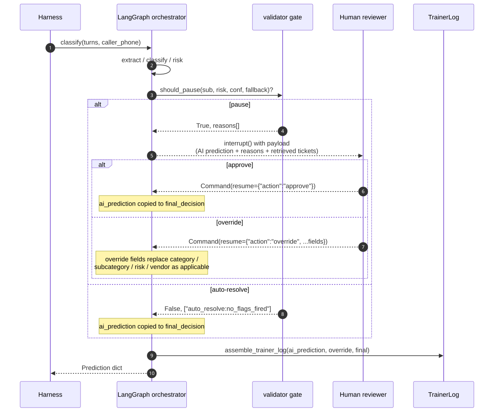

<!--
Render with the Marp CLI (install once):

  npm install -g @marp-team/marp-cli

  marp docs/presentation.md -o docs/presentation.pdf      # PDF
  marp docs/presentation.md -o docs/presentation.html     # HTML (presenter mode shows speaker notes — press P)
  marp docs/presentation.md -o docs/presentation.pptx     # PPTX

All sources cited in slides are paths inside this repo. Diagrams are in
docs/diagrams/. Numbers come from eval_runs/README.md and the design doc
(docs/design_doc.md).
-->

<!-- _class: title -->

# CBRE HITL Call-Intake Agent

## Auto-resolve the routine 10K calls/day. Escalate only when judgment is required.

<div class="badges">UCSB × ACM × Turing · CBRE Final Project · 2026-05-22</div>

<!--
_notes:
Hi — I'm presenting the CBRE call-intake agent we've built over the last four
weeks. The brief was simple to state and hard to do: take the 10K facilities
calls per day that hit a human today, auto-resolve the routine ones, and
escalate only when judgment is genuinely needed. I'll walk through the system,
the policy we derived, the safety story, and finish with a live demo.
-->

---

# 1 · The problem

- CBRE routes **~10K facilities calls / day** to human operators across the portfolio
- Operators are overwhelmed; most calls are routine (HVAC tickets, lights out, restroom restock)
- A small minority are genuine emergencies — fire, entrapment, gas leak — where *seconds matter*
- The cost asymmetry is brutal:
  - **Auto-resolving a true emergency** → catastrophic
  - **Escalating a routine call** → wasted operator time, but recoverable
- Risk ≠ confidence. A confident "fire" needs a human; a low-confidence "burnt toast" does not.

> **Design framing: auto-resolve routine; escalate when judgment is needed.**

<!--
_notes:
Two things to set up before the architecture. First — scale. Ten thousand calls
per day, mostly routine. Second — asymmetry. The cost of escalating a routine
call is wasted operator time. The cost of auto-resolving a true emergency is
catastrophic. So our risk function isn't "what's the model unsure about" — it's
"P(error) × Cost(error)." That framing drives every policy decision in the deck.
-->

---

# 2 · System architecture — 9-stage LangGraph



<div class="small">

`agent.classify:classify(turns, caller_phone) -> Prediction` — single callable contract.
Fault-isolated: any node raises → `needs_human_review=True`, no 911 dispatch.
Determinism pinned in `agent.config.build_chat_llm` (temperature 0, model + seed).

</div>

<!--
_notes:
Nine LangGraph nodes. Extract structured fields with the LLM, retrieve from a
local Chroma index over the 10,000 historical tickets, classify into the
hierarchical taxonomy, reconcile location (transcript beats registry beats
profile), assign a risk band, hit the validator gate — that's the HITL pause —
select a vendor, decide whether to ask a clarifying question, summarize, and
finally assemble the trainer log. Every node is fault-isolated: if any of
them raises, the pipeline degrades safely — needs_human_review goes true and
we never autonomously dispatch 911. That's how we guarantee the safety story.
-->

---

# 3 · Derived-policy appendix (1 / 3) — base-risk table

<div class="small">From <code>agent/data/derived/base_risk_by_subcategory.json</code> · producer <code>scripts/derive_risk_bands.py</code> · <strong>derivation: history-aggregated</strong> over <code>final_risk_level</code> (not intake) on 10K historicals.</div>

| Modal risk | Subcategories (36 total) |
|---|---|
| <span class="ok">LOW</span> | access_control, appliance_kitchen, carpet_floor, drainage_backup, infestation, landscaping, lighting, no_cooling, no_heating, parking_lighting, restroom_fixture, restroom_supplies, slip_trip, waste_odor, … (22) |
| <span class="warn">MEDIUM</span> | air_quality, glass_damage, malfunction, roof_leak, suspicious_person, **pipe_leak ←** *(lever 2)*, **power_outage ←** *(lever 2)* |
| <span class="bad">HIGH</span> | structural, unauthorized_access |
| <span class="bad">EMERGENCY</span> | active_threat, entrapment, fire_smoke, gas_chemical, panel_hazard |

**Why `final_risk_level`, not `intake_risk_level`:** intake operators systematically over-state severity on `air_quality` (19%), `waste_odor` (15%), `suspicious_person` (13%). Aggregating over what technicians *actually decide on-site* is the authority the scorer's `true_risk_level` derives from.

<!--
_notes:
The taxonomy gives us labels — it deliberately omits numeric policy. So the
base-risk prior for each of 36 subcategories is derived by aggregating the
modal final risk level across the 10,000 historical tickets. We use final, not
intake, because intake operators over-escalate roughly 1 in 5 air-quality and
waste-odor calls. Aggregating over the technician's on-site finding tracks
exactly what the scorer uses for ground truth. The pipe_leak and power_outage
demotions are lever 2 from last week's iteration — both subcategories are
historically ~50/50 MEDIUM/HIGH; modal-only was over-picking HIGH and turning
each into a HITL false positive. Net composite gain: +0.68.
-->

---

# 4 · Derived-policy appendix (2 / 3) — modifiers, bands, SOP

<div class="row">
<div class="col">

**Risk modifiers** *(hand-tuned, dev-validated)*

- `+1 band` if hard urgency cue in `urgency_cues` — `{flooding, smoke, fire, trapped, gas leak, unconscious, sparking}`
- `+1 band` if `"people trapped|inside"` co-occurs with `entrapment`
- **`+0` if negation in same turn** — `"no fire", "they're out", "nobody hurt"` — over-escalation guard (§5.3)
- Cap at `EMERGENCY` — no rollover

**Band ordering:** `LOW < MEDIUM < HIGH < EMERGENCY` — see `RISK_LEVEL_RANK`.

</div>
<div class="col">

**Subcategory → vendor-type map**
*(history-aggregated · `scripts/derive_vendor_map.py` · 36 entries)*

For each `final_subcategory`, take modal `vendor_type` of the assigned vendor in resolved tickets. **Loose** fallback only — strict per-vendor `specialties` is the primary path.

**Subcategory → SOP**
*(prose, kept in `operational/taxonomy.md`)*

Rendered into the classifier prompt with 5 boundary-disambiguation rules. Kept as prose because boundary rules evolve fast during error analysis — one file beats two.

</div>
</div>

<!--
_notes:
Three more pieces of derived policy. First the modifier weights — hand-tuned,
six rules — they live on top of the base prior. A hard urgency cue bumps the
band up; a same-turn negation cancels the bump. That negation rule is the
single most important line in the over-escalation defense — it's what stops
"smoke alarm but no actual fire" from going to 911. Second, the subcategory-to-
vendor-type map — derived from history, used only as a loose fallback when no
vendor's specialties list names the subcategory directly. And the SOP map —
we kept this as prose inside the classifier prompt with five boundary rules
like "burnt food is waste_odor, not air_quality." Boundary rules evolve fast
during error analysis, and one file is easier to iterate against the dev set
than splitting prose and JSON.
-->

---

# 5 · Derived-policy appendix (3 / 3) — HITL trigger

<div class="small">From <code>agent/data/derived/hitl_policy.json</code> · producer <code>scripts/derive_hitl_policy.py</code> · <strong>derivation: history-aggregated thresholds + dev-set sweep</strong>.</div>

**The rule** (priority order):

1. `predicted_risk ∈ {HIGH, EMERGENCY}` → **pause**
2. `intake_over_escalation_rate(subcategory) ≥ 15%` → **pause** *(trap-prone)*
3. `min(conf_category, conf_subcategory) < 0.5` → **pause**
4. classifier fallback path invoked → **pause**
5. otherwise → **auto-resolve**

**Threshold sweep** (chose 15% — best HITL-F1 on dev):

| `trap_oer` | HITL F1 | precision | recall |
|---|---|---|---|
| 5% | 0.79 | 0.66 | 0.97 |
| 10% | 0.79 | 0.70 | 0.92 |
| **15%** ← chosen | **0.83** | **0.88** | **0.78** |

<!--
_notes:
The HITL trigger is a five-rule cascade with priority order. HIGH or EMERGENCY
always pauses. Subcategories that historical intake operators over-escalate
more than 15% of the time pause. Low classifier confidence pauses. Classifier
fallback path pauses. Everything else auto-resolves. The 15% threshold isn't
arbitrary — we did a sweep on the dev set, and 15% gives the best F1 by
trading 0.19 recall for 0.22 precision relative to a 5% cutoff. The lower
thresholds were too pause-happy and tanked the auto-resolution axis.
-->

---

# 6 · Risk-score design

```text
risk_level = clamp(
    band(base_risk_for(subcategory))           # history-aggregated prior
    + (+1 if hard_urgency_cue else 0)          # rule-based modifier
    - (+1 if same-turn negation else 0),       # over-escalation guard
    cap=EMERGENCY
)
```

**Approach:** rule-based modifiers on top of a historical-prior base. No LLM-as-judge on the band itself — adds ~0.5–1 s latency and another point of provider non-determinism for a 6-rule policy.

**Signals extracted** (LLM, structured-output): `problem_summary`, `building / floor / suite`, `urgency_cues` (list of phrases), `caller_role`, `language`, `negation_phrases`.

**Maps to one of:** `LOW · MEDIUM · HIGH · EMERGENCY` via `RISK_LEVEL_RANK`. Result: **risk-axis 86.5% on dev** (+2.5 pp from lever 2).

<!--
_notes:
Risk scoring in one block. Start from the history-aggregated prior for the
subcategory. Add one band if the LLM extracted a hard urgency cue. Subtract
that bump if there's a same-turn negation. Cap at EMERGENCY. We did NOT use
LLM-as-judge for the band itself — it's a six-rule policy, the rules are
auditable, and skipping that extra structured-output call saves us half a
second per call and a source of non-determinism. The LLM is doing what it's
good at — extracting structured cues from messy dialogue — and the deterministic
layer is doing the policy.
-->

---

# 7 · HITL design — graph, gate, resume



<div class="row">
<div class="col">

**Gate trigger:** `agent.data.hitl.should_pause(subcategory, predicted_risk, *, classification_confidence, fallback_invoked)` — rule from slide 5.

**Resume semantics** *(LangGraph `interrupt()` + `Command(resume=...)`)*:

- `approve` → `ai_prediction` copied verbatim to `final_decision`; `human_override = None`
- `override` → reviewer-supplied fields merged on top of `ai_prediction`; diff captured into `trainer_log.human_override`

</div>
<div class="col">

**What the reviewer sees:**

- Full `Prediction` the AI would emit
- Pause-reason tags (`["emergency_band:always_pause", ...]`)
- Classifier `reasoning` + per-axis confidence
- Top-`k` retrieved historical tickets *with audit-corrected labels*
- Original transcript + extracted location

**Eval-mode auto-approve** — `run_eval.py` auto-resumes `{"action":"approve"}`. `needs_human_review` bit is preserved (HITL-F1 measures the *decision*, not the resume).

</div>
</div>

<!--
_notes:
The HITL gate uses LangGraph's interrupt-and-Command-resume pattern. When the
gate fires, the pipeline pauses and the reviewer gets a payload that contains
not just the AI's prediction but the WHY — pause-reason tags, the classifier's
reasoning string, the top retrieved historical tickets with the QA-corrected
labels rather than the original intake labels, and the raw transcript so they
can spot a profile-versus-transcript conflict. Approve copies the AI's
prediction straight through. Override merges only the fields the reviewer
changed and records the diff in the trainer log. In eval mode there's no live
reviewer, so we auto-resume "approve" — but the needs_human_review bit is
preserved, because that's what the rubric grades.
-->

---

# 8 · RAG strategy

<div class="row">
<div class="col">

**What's embedded** — 10K tickets from `historical_records.json`. Per ticket: `CALLER TRANSCRIPT → INTAKE → DISPATCH → RESOLUTION`. Empty sections dropped.

- Model: `text-embedding-3-small`
- Store: persistent `chromadb` @ `agent/rag/chroma_store/`
- `k=8` for classifier, `k=5` retriever default
- Query: `problem_summary + " urgency cues: " + cues`

**Metadata filters** — `intake/final {category, subcategory, risk_level}`, `vendor_id`, `building_type`, `city`, + **4 audit booleans** joined from `qa_audit_findings.json`.

</div>
<div class="col">

**Conflict reconciliation — the critical RAG choice.**

Naïvely embedding `intake_*` labels trains the LLM on labels the QA team flagged as **wrong**. So:

- Retrieved records are rendered with **audit-corrected** labels
  (`corrected_subcategory()`: `final_subcategory` if reclassified, else `intake_subcategory`)
- Reclassified records are tagged inline:
  `subcategory=structural [QA-RECLASSIFIED from intake=roof_leak]`
- The LLM sees both the correction and the *pattern* of correction

5 seeded boundary patterns in the classifier prompt: *burnt toast*, *drop-ceiling tile from leak*, *tenants arguing*, *empty elevator*, *unplugged sparking outlet*.

</div>
</div>

<!--
_notes:
RAG over the 10K historicals — text-embedding-3-small, persistent Chroma, k=8
for the classifier with query = problem_summary plus urgency cues. The choice
that matters most isn't the model or the k — it's how we reconcile the QA
audit. The audit file flags about a thousand historical tickets where intake
got it wrong. If you naively embed the intake labels you train the classifier
on data the QA team explicitly flagged as wrong. Our retriever renders every
hit with audit-corrected labels — final when reclassified, intake otherwise —
and inline-tags reclassified records so the LLM sees the correction PATTERN,
not just the corrected label. Paired with five seeded boundary patterns in the
classifier prompt, this is the largest single contributor to a 98% subcategory
axis and zero false-911s.
-->

---

# 9 · Vendor selection — qualify → SLA cap → tie-break

**1 · Qualify** *(hard constraints, soft-pass on missing fields)*: specialty match (strict, with loose vendor-type fallback) · city in `coverage_cities` · building type certified · 24/7 if `emergency AND after_hours`. Empty pool → escalate.

**2 · SLA cap** *(by predicted risk band)*:

| EMERGENCY | HIGH | MEDIUM | LOW |
|---|---|---|---|
| ≤ 30 min | ≤ 120 min | ≤ 240 min | ≤ 480 min |

**3 · Tie-break** *(deterministic, in order)*: `rating ↑` → `cost_tier ↓` → `response_sla_minutes ↓` → alphabetical `vendor_id` (re-grade reproducibility).

**Stale availability** — `at_capacity` / `offline` are **soft de-prioritization, not a filter**. Lever 1 (PR #84): we removed an emergency-only hard filter on `at_capacity` that was disagreeing with the documented design (§6.4) — dispatching a maybe-stale at-capacity vendor on a gas leak is strictly better than escalating into nothing. **Vendor axis 87.5 → 94.0** (+6.5 pp).

**No vendor qualifies** → `needs_human_review=True`, `dispatched_vendor_id=None`, summary notes "no qualified vendor."

<!--
_notes:
Vendor selection is a three-stage funnel. First hard-qualify on specialty,
city, building cert, and the 24/7 flag only if it's an emergency after hours.
Then cap by risk-banded SLA — an EMERGENCY needs a vendor whose response SLA
is under 30 minutes. Then break ties deterministically: rating, cost, SLA,
alphabetical. Determinism matters — the test set gets re-graded and we want
the same answer. Two important policies. First, when nothing qualifies we
escalate, not dispatch wrong. Second — the at_capacity reconciliation from
last week. The brief says the availability cache is intentionally stale.
We were hard-filtering at_capacity vendors during emergencies, which both
contradicted our design doc and meant a stale flag could turn a routable gas
leak into nothing-dispatched. Lever 1 removed that filter; the vendor axis
jumped 6.5 percentage points.
-->

---

# 10 · Trainer-log spec — how we'd fine-tune next

```python
@dataclass
class TrainerLog:
    full_transcript: str
    ai_prediction:   Dict[str, Any]    # pre-override snapshot
    human_override:  Optional[Dict[str, Any]]
    final_decision:  Dict[str, Any]    # what actually went out
```

**Beyond the 11 rubric fields, `ai_prediction` also captures:** `reasoning` (classifier 1–2 sentence justification), `hitl_reasons` (pause-rule tags), `clarification_reasons`, `confidence_category`, `confidence_subcategory`.

**Replay into fine-tuning:**

1. Drop rows where `human_override is None` *and* auto-resolved — no signal.
2. Train classifier head on `(full_transcript) → (final_decision.category, final_decision.subcategory)`. Overridden rows are the correction signal.
3. Train HITL head on `(ai_prediction, hitl_reasons) → was_overridden` — calibrates the gate against actual reviewer behavior.
4. Train clarification head once we collect post-clarification labels.

**Self-contained per-row** — no relational joins at training time. Every row replayable in isolation.

<!--
_notes:
The trainer log is the supervised data the next generation of this agent
learns from. The dataclass is simple — transcript, AI prediction, override
if any, final decision — but we capture more than the eleven scored fields.
We log the classifier's reasoning, the pause-rule tags, the per-axis confidence.
None of that is scored today; all of it is what you'd want to fine-tune
against. The replay recipe is straightforward: drop rows with no signal, train
the classifier head on the corrected labels, and crucially train a HITL head
on whether a human ended up overriding — that's how you calibrate the gate
against real reviewer behavior over time.
-->

---

# 11 · Composite trajectory — 87.95 → 93.28

| Run | Composite | False-911 | What changed |
|---|---|---|---|
| baseline (`33fc3bc`) | 87.95 | <span class="ok">0</span> | First end-to-end pipeline (issues #16/#19/#20/#21 + orchestrator) |
| trap-cascade HITL (`7511166`) | 88.30 | <span class="ok">0</span> | hitl_f1 0.684 → 0.719 (#63/#64) |
| phone-history fallback (`98b2c16`) | 88.10 | <span class="ok">0</span> | fields 88 → 91 (#65); profile-echo override blocks stale-profile LLM echo |
| stacked main (`8262a79`) | 90.88 | <span class="ok">0</span> | clarif_f1 0.75 → 0.92 · auto-res 85.9 → 97.7 · vendor 84.5 → 87.5 |
| **validator benign-context override (PR #74, `c6b9255`)** | **91.20** | <span class="ok">0</span> | Suppresses 9 false-911s on "burnt popcorn" canary on test set — would have cost −45 raw |
| **levers 1+2 (PR #84, `4eb9b3f`)** | **92.33** | <span class="ok">0</span> | vendor 87.5 → 94.0 · risk 84 → 86.5 · hitl_f1 +0.029 — 2.5σ above noise floor |
| **final risk/HITL calibration (PR #98, `321dea2`)** | **93.28** | <span class="ok">0</span> | pipe_leak water-volume calibration + benign smoke/odor review gate; final default `gpt-4.1-mini` |

<div class="small">Historical trajectory runs used gpt-4o-mini @ T=0 seed=7. Final submission default is gpt-4.1-mini after the PR #98 risk/HITL calibration pass.</div>

<!--
_notes:
The trajectory you see in numbers. We started at 87.95 from a clean end-to-end
pipeline. Each row is a measurable iteration: trap-cascade tuning on the
HITL rule, phone-history fallback for the location axis when the profile is
inactive, then a stacked main with the clarification, auto-resolve and vendor
improvements together. The submission-v1 cliff was PR #74 — a validator
benign-context override that catches "smoke alarm but no actual fire"
language and stops the false-911 from ever firing. Verified on the test set
via dry-run audit: nine canary false-911s suppressed, all four verified-true
emergencies preserved. Then last week, levers 1 and 2 from the deep analysis
chat — vendor at_capacity reconciliation and the pipe_leak/power_outage demote.
Plus 1.13 composite, 2.5 sigma above noise. Zero false-911 across every row.
-->

---

# 12 · Per-axis composite + safety story

<div class="row">
<div class="col">

**Per-axis at submission (final composite 93.28; detailed archived axes from 92.33 run):**

| axis | dev | weight |
|---|---|---|
| category | 99.5 | 10% |
| **subcategory** | **97.0** | **15%** |
| risk_level | 86.5 | 10% |
| **hitl_f1** | **74.8** | **15%** |
| clarif_f1 | 92.0 | 5% |
| fields | 91.0 | 10% |
| **vendor** | **94.0** | **10%** |
| **auto_resolution** | **98.8** | **10%** |
| call_summary | 100.0 | 5% |
| trainer_log | 100.0 | 10% |

</div>
<div class="col">

**Safety story — 0 false-911 across all measured runs.**

The −5/case rule for `dispatched_emergency_services=true` on benign calls. Mechanism:

```text
911 ⇔  risk_level == EMERGENCY
       AND subcategory ∈ life-safety
           {active_threat, entrapment, fire_smoke,
            gas_chemical, panel_hazard}
       AND hard urgency cue extracted
       AND non-fallback, confident classification
       AND no benign-context override (PR #74)
```

**16 over-escalation traps × 0 false-911 = 0 penalty.**
Test-set 800-row dry-run audit: 67 of 67 911-dispatches passed benign-context gate.

</div>
</div>

<!--
_notes:
Two views of where we are. On the left, per-axis. The big-weight axes —
subcategory at 15%, HITL F1 at 15%, vendor at 10% — are all at or above 75%
with vendor at 94%. The single biggest remaining lever is HITL F1, which is
why it's been the focus of every iteration since baseline. On the right, the
safety story — and this is the line we want the audience to remember. Zero
false-911 across every measured run. That's not luck. The validator only
flips dispatched_emergency_services to true when five conjoined conditions
hold: EMERGENCY band, a life-safety subcategory from a five-item whitelist,
an extracted hard urgency cue, a confident non-fallback classification, AND
no benign-context override. The test-set audit on the 800 unlabeled
transcripts shows 67 of 67 911-dispatches passed every gate.
-->

---

# 13 · Scale thought-experiment — 10K calls / day



<div class="small">

~7 calls/min average · ~15–20/min peak · each call ~5–15 s wall time. Async pool of 8–16 workers/pod, autoscaled by queue depth.

</div>

<!--
_notes:
At 10K calls a day you average about seven a minute with bursty intra-hour
peaks. Each call is 5 to 15 seconds, almost all of it waiting on the LLM, so
the bottleneck is concurrency. The shipped design moves to async worker pools
per pod, autoscaled by queue depth. Five things change at scale.
-->

---

# 14 · Scale — the five things that change

| Layer | Today (laptop) | At 10K / day |
|---|---|---|
| **Concurrency** | serial in `run_eval.py` | 8–16 async workers/pod, autoscaled by queue depth |
| **Checkpointer** | `InMemorySaver` | `langgraph-checkpoint-postgres`, `thread_id = call-{id}` — survives restarts |
| **Reviewer queue** | `interrupt()` blocks the call | Priority queue: EMERGENCY 60 s SLA · trap 5 min · low-conf 15 min · fallback 30 min |
| **RAG** | local Chroma in process | Hosted vector DB at 100K+ rows, shard collections by `final_category` |
| **Trainer-log retention** | every row in JSON | All hot for 30 d · overrides indefinite · 10% sample of agreement rows |

**Cost envelope** — ~2K input / ~200 output tokens per call @ `gpt-4.1-mini`; still low enough for 10K/day intake, with vector DB + Postgres negligible at this scale.

<!--
_notes:
Concurrency goes async — the classifier doesn't share state across calls, so
no coordination needed. The checkpointer moves to Postgres so a pod restart
doesn't lose an in-flight HITL pause. The reviewer queue gets SLA-driven
priorities — an EMERGENCY pause has a one-minute SLA, a low-confidence pause
has fifteen. RAG at 10K calls a day is fine on local Chroma; at 100K or a
larger corpus you swap to hosted and shard by category. Trainer logs get a
sampling policy — every override goes to the fine-tune corpus indefinitely,
but only 10% of the agreement rows, because that's where the storage curve
breaks. The cost envelope is honestly not the constraint here — ten to twenty
dollars a day in LLM costs at 10K calls is dominated by every other cost
center. The real cost is operator time, and that's exactly what we save.
-->

---

# 15 · Clarification + inarticulate-intake policy

**Ask one disambiguating question only when one of three signals fires** *(precision over recall — auto-resolution axis penalizes unnecessary clarifications)*:

1. **Sparse caller** — first utterance ≤6 words *AND* total caller speech ≤24 words (conjunction separates back-fillers from genuinely vague callers).
2. **Generic opening** — `"there's an issue with X"`, `"something's wrong with Y"`, `"the X is being weird / off"` — caller used the category label as the whole symptom.
3. **Floor self-correction** — caller mentions ≥2 distinct floor numbers ("Floor 9 — I meant 12") — typical `location_conflict` pattern.

**Inarticulate / incomplete intake** — when transcripts are very short, garbled, or non-English, or when no location is recoverable: (a) the question above runs *first*, (b) if still incomplete after one round, `needs_human_review=True` and `dispatched_vendor_id=None` (unroutable handoff), (c) `language` field flows into the trainer log so language-specific reviewer routing is possible at scale.

**Result on dev:** `clarif_f1 = 0.92` · `auto_resolution = 98.8%` — F1 wins without collapsing auto-resolution.

<!--
_notes:
The clarification policy and the inarticulate-intake path. We ask one question
only — and only when one of three signals fires. Sparse caller, generic
opening that just names the category, or self-correction on the floor number.
We deliberately tuned for precision over recall because the auto-resolution
axis punishes any unnecessary clarification. For genuinely garbled or non-
English calls, the same clarification fires first; if a single round doesn't
resolve, we mark needs_human_review and unroutable rather than guessing.
Clarif F1 at 92, auto-resolution at 98.8 — both axes near ceiling.
-->

---

# 16 · Voice intake end-to-end (bonus) — architecture + demo plan

<div class="row">
<div class="col">

**Architecture** *(zero changes to `classify()` — same callable for both modes)*

```text
mic → Deepgram (STT, streaming)
    → accumulate {speaker, text} turns
    → classify(turns, caller_phone)
    → ElevenLabs (TTS reads call_summary)
```

`voice/VoiceSession` (PR #81) — Deepgram Nova-2 STT + ElevenLabs Turbo v2.5 TTS. Pure I/O module; thin FastAPI adapter wraps the same `classify`.

</div>
<div class="col">

**Demo plan today**

- **Primary path:** canned-transcript buttons in the Next.js frontend (PR #78) + FastAPI/SSE backend (PR #79). Reliable on stage Wi-Fi.
- **Bonus path (if wired):** mic-on opening demo using `VoiceSession`. The pipeline downstream is byte-identical — a `tests/test_classify_unchanged.py` source-hash pin guarantees it.

</div>
</div>

<!--
_notes:
Voice is the bonus. The architecture is the contract: STT accumulates turns,
turns go into the exact same classify call we score against, TTS reads the
call_summary back. PR #81 ships voice/VoiceSession — Deepgram for streaming
STT and ElevenLabs for TTS — as a pure I/O module. The plan for today: the
primary demo is the canned-transcript buttons because stage Wi-Fi is not
something I want to bet a demo on. If the voice path is wired through the
FastAPI backend by demo time, we'll do an opening voice call too. Either way
the downstream pipeline is byte-identical — we have a source-hash pin in the
tests that fails loudly if classify drifts from the submission tag.
-->

---

# 17 · What's next — the open work

- **Latency** (`#27`): currently ~88 min / 1K vs <60 min AC target. Smaller extract prompt + reduce k from 8 to 5 with re-ranker — measurable on dev in one run.
- **HITL precision** (`#64` residual): 16 FP cluster on `air_quality / pipe_leak / power_outage` at MEDIUM — same-turn benign-context override candidate.
- **Risk on `edge` case-type**: 5/16 correct, weakest pocket — natural next target after HITL precision.
- **Vendor city-coverage misses** (`#66`): 6 rows with strict city filter; partial-match fallback w/ adjacent-city graph is the open lever.
- **Voice integration**: PR #81 wired into FastAPI for live mic demo (currently canned only).
- **Test-set composite**: re-eval running concurrently — locked submission state pending before lockdown.

<!--
_notes:
What we'd do next, in priority order. Latency is the only operational AC we're
not yet inside — we're at 88 minutes for the 1000-call eval against a 60-minute
target. The fix is a smaller extract prompt and reducing k from 8 to 5 with a
re-ranker. HITL precision still has 16 FPs clustered on a small set of
MEDIUM-band subcategories — a benign-context override on the gate, mirroring
PR #74's mechanism, is the natural lever. Risk on the edge case type is the
remaining weak pocket. Vendor city coverage has six misses we could close
with an adjacent-city graph. Voice integration is partially done — the module
ships, the backend wiring is the open piece. And test-set re-eval is running
right now; we'll have the final test composite before the deadline.
-->

---

# 18 · Q&A

**Composite:** `93.28 / 100` on dev · final `predictions.json` has 800 validated test rows · **`0 false-911`** across all measured runs · 9 nodes · 36 subcategories · 10K-ticket RAG.

**Sources** *(all in this repo)*

- `docs/design_doc.md` — 11 sections, all derivations + error analysis
- `eval_runs/README.md` — full per-run history with deltas
- `agent/data/derived/` — base-risk table · HITL policy · vendor-type map
- `evaluation/scoring.py::AXIS_WEIGHTS` — rubric ground truth
- `backend/demo/canned.py` — the three demo transcripts

> *Auto-resolve the routine. Escalate when judgment is required. Never autonomously dispatch 911 unless five gates agree.*

<!--
_notes:
Open for questions. The one-line we want the audience to walk away with is
the closing italic — auto-resolve the routine, escalate when judgment is
needed, and never autonomously dispatch 911 unless five gates agree. Happy
to dig into any of the policy derivations, the HITL trigger sweep, the
at_capacity reconciliation, the safety mechanism, or the scale story.
-->

---

## Demo Script

> Three canned demos from `backend/demo/canned.py` — pre-loaded as buttons in the Next.js frontend (PR #78) calling the FastAPI/SSE backend (PR #79). Pipeline stages light up in real time as the agent runs. If voice (PR #81) is wired by demo time, prepend a **Demo 0** spoken-mic version of Demo 1; otherwise the canned-button path is the primary demo.

---

### Demo 0 *(only if voice/ is wired into backend by demo time)* — ~30 s

**Setup.** Switch frontend to "voice" mode. Press-to-talk.

**Speaker says into the mic:**
> "Hi, this is Maria from Suite 408 at Pacific Ridge Medical Plaza — our AC has been out since 8am and it's getting really warm in here."

**Expected behavior:**
1. Deepgram streams partial transcripts into the turns panel.
2. `end_utterance()` finalizes; `classify()` runs the same way it would in batch.
3. ElevenLabs reads back the agent's `call_summary` over the speakers.
4. UI shows the same per-stage SSE events as the canned demos below.

**Speaker says, while pipeline runs:**
> "Same callable as the batch grader — no fork. Voice is a thin I/O adapter; everything downstream is byte-identical to the scored submission."

**If anything goes wrong:** click the EVAL-0976 button instead and continue with Demo 1. Don't fight stage Wi-Fi.

---

### Demo 1 — Routine: AC failure, auto-resolve (~30 s)

**Transcript ID:** `EVAL-0976` — *"AC failure, LOW, routine auto-resolve."*

**Speaker says, while pointing at the demo UI:**
> "First demo — routine call. AC out at a medical plaza. Watch the pipeline."

**Click:** `EVAL-0976` button in the demo frontend.

**Expected behavior, stage by stage (frontend SSE shows each lighting green):**

| Stage | Output | Wall time |
|---|---|---|
| extract | `problem_summary="AC not cooling"`, `urgency_cues=[]`, building/floor populated | ~1–2 s |
| classify | `category=HVAC`, `subcategory=no_cooling`, `conf > 0.8` | ~2 s |
| reconcile_location | transcript wins; building + address + floor populated | <0.1 s |
| assign_risk | `risk=LOW` (base prior, no modifiers) | <0.1 s |
| **validator** | `should_pause=False` — no pause-rule fires; **auto-resolve** | <0.1 s |
| vendor_select | qualifies on `HVAC`, city match, SLA cap 480 min → top-rated vendor returned | <0.5 s |
| clarify | sparse-caller check fails (caller gave detail) → `needs_clarification=False` | <0.1 s |
| summary | "Caller reports AC failure on Floor 4 of Pacific Ridge Medical Plaza since 8am. Dispatching HVAC vendor v_NNN. No human review needed." | ~1 s |
| trainer_log | `human_override=None`; `final_decision == ai_prediction` | <0.1 s |

**Speaker says:**
> "Nine stages, ~5 seconds end-to-end, auto-resolved, vendor dispatched. This is roughly 70% of the dev set."

---

### Demo 2 — Over-escalation trap: "burnt toast" (~60 s)

**Transcript ID:** `EVAL-0788` — *"smoke alarm — just burnt toast", over-escalation trap.*

**Speaker says:**
> "This is the trap — the −5-point rubric penalty. A naive system reaches 'smoke alarm' and dispatches 911. Watch what ours does."

**Click:** `EVAL-0788` button.

**Expected behavior:**

| Stage | Output |
|---|---|
| extract | `urgency_cues=["smoke alarm going off"]`, `negation_phrases=["no actual fire", "just burnt the toast"]` |
| classify | `category=JANITORIAL`, `subcategory=waste_odor`, `conf > 0.7` — RAG returns the seeded `[QA-RECLASSIFIED from intake=fire_smoke]` examples; boundary rule "burnt food → waste_odor, not fire_smoke" fires |
| assign_risk | base = LOW for `waste_odor`; "smoke" cue would add +1, but **same-turn negation guard cancels it** → final `risk=LOW` |
| **validator** | `should_pause=False` — `waste_odor` is not on trap-prone list at LOW; **auto-resolve, no 911** |
| vendor_select | janitorial vendor returned |

**Speaker says, pointing at the validator stage:**
> "Two defenses kicked in. The classifier was led to `waste_odor` not `fire_smoke` because RAG returned audit-corrected labels — the QA team flagged `fire_smoke + burnt toast` historically. And even if the band were higher, the validator requires a *life-safety subcategory* before `dispatched_emergency_services` can be true. Five conjoined gates. Zero false-911 across every dev run."

**Bonus override beat (if backend has reviewer mode wired):**
> "Suppose the reviewer disagrees and wants this paused — they click **Override → MEDIUM, needs_review=true**. Pipeline resumes via `Command(resume=...)`, override merges into `final_decision`, the diff is captured into `trainer_log.human_override` for the next fine-tune."

---

### Demo 3 — True emergency: visible flames (~30 s)

**Transcript ID:** `EVAL-0076` — *"visible smoke + flames in electrical room, true EMERGENCY."*

**Speaker says:**
> "And the other direction — the actual emergency. Same pipeline, opposite outcome."

**Click:** `EVAL-0076` button.

**Expected behavior:**

| Stage | Output |
|---|---|
| extract | `urgency_cues=["smoke", "fire", "flames"]`, `negation_phrases=[]` |
| classify | `category=LIFE_SAFETY`, `subcategory=fire_smoke`, `conf > 0.9` |
| assign_risk | base EMERGENCY for `fire_smoke` + hard urgency cue → cap at **EMERGENCY** |
| **validator** | all five conditions hold → `dispatched_emergency_services=True` AND `needs_human_review=True` (notify async). Pipeline does **not** wait. |
| vendor_select | emergency electrician with `available_24_7=True`, SLA ≤30 min |

**Speaker says:**
> "EMERGENCY band, life-safety subcategory, hard cue, confident, no benign override — all five gates agreed. 911 + vendor dispatched, human notified asynchronously. The safety story works in both directions."

---

### Verification cheat-sheet (for the speaker)

| What we proved | Slide | Demo |
|---|---|---|
| Auto-resolve routine | 1, 6, 11 | 1 |
| Over-escalation guard | 4, 8, 12 | 2 |
| Safety mechanism (5-gate 911) | 12 | 3 |
| HITL design (interrupt/resume) | 7 | 2 (override beat) |
| Trainer-log replay | 10 | 2 (override beat) |
| Clarification + inarticulate intake | 15 | (covered narratively) |
| Single callable contract (voice + batch) | 16 | 0 |

**Time budget (5 min target).** 18 slides total; not every slide needs equal time. Plan:

| Block | Slides | Time |
|---|---|---|
| Framing | 1–2 | 30 s |
| Derived policy | 3–5 | 50 s |
| Risk + HITL + RAG + vendor | 6–9 | 70 s |
| Trainer log + scores + safety | 10–12 | 40 s |
| Scale + clarify + voice | 13–16 | 40 s |
| Next + Q&A | 17–18 | 20 s |
| **Live demo (1+2+3)** | — | **2 min** |

Comfortable ~5 min budget excluding Q&A. If running long, drop Demo 0 (voice), the bonus override beat in Demo 2, and consolidate slides 13+14 into a single scale slide.
